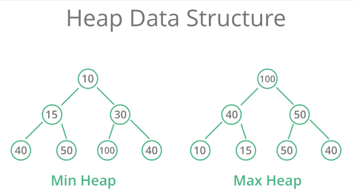

# Heap

A Heap is a special Tree-based data structure in which the tree is a complete binary tree. Generally, Heaps can be of two types:

1. Max-Heap: In a Max-Heap the key present at the root node must be greatest among the keys present at all of it’s children. The same property must be recursively true for all sub-trees in that Binary Tree.

2. Min-Heap: In a Min-Heap the key present at the root node must be minimum among the keys present at all of it’s children. The same property must be recursively true for all sub-trees in that Binary Tree.



## Exercises

### Problem: Heap Sort
Given a list of numbers as shown below, please sort them in ascending order.

### Solution
```php
<?php
 
function MaxHeapify(&$data, $heapSize, $index) {
   $left = $index * 2 + 1;
   $right = $index * 2 + 2;
   $largest = 0;
 
   if ($left < $heapSize && $data[$left] > $data[$index])
      $largest = $left;
   else
      $largest = $index;
 
   if ($right < $heapSize && $data[$right] > $data[$largest])
      $largest = $right;
 
   if ($largest != $index)
   {
      $temp = $data[$index];
      $data[$index] = $data[$largest];
      $data[$largest] = $temp;
 
      MaxHeapify($data, $heapSize, $largest);
   }
}
 
function HeapSort(&$data, $count) {
   $heapSize = $count;
 
   for ($p = $heapSize / 2 - 1 ; $p >= 0; $p--)
      MaxHeapify($data, $heapSize, $p);
 
   for ($i = $count - 1; $i > 0; $i--)
   {
      $temp = $data[$i];
      $data[$i] = $data[0];
      $data[0] = $temp;
 
      $heapSize--;
      MaxHeapify($data, $heapSize, 0);
   }
}
 
$array = array(20,43,65,88,11,33,56,74);
HeapSort($array,8);
print_r($array);
 
?>
```
## Homework

### Problem
Write an efficient program for printing k largest elements in an array. Elements in array can be in any order.

For example, if given array is [1, 23, 12, 9, 30, 2, 50] and you are asked for the largest 3 elements i.e., k = 3 then your program should print 50, 30 and 23.