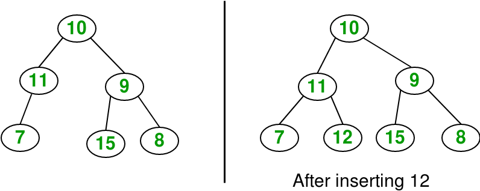

# Tree
In this chapter, we will go next to a new data structure, its more complicate than others we've learned.

**Tree** represents the nodes connected by edges. We have some terminologies:
- **Root**: Top node in a tree
- **Child**: Nodes that are next to each other and connected downwards
- **Parent**: Converse notion of child
- **Siblings**: Nodes with the same parent
- **Descendant**: Node reachable by repeated proceeding from parent to child
- **Ancestor**: Node reachable by repeated proceeding from child to parent.
- **Leaf**: Node with no children
- **Internal node**: Node with at least one child
- **External node**: Node with no children

You see, same to tree in natural, we have root, leaf. Thats why we name its tree.


## Binary Tree

A binary tree is a structure comprising nodes, where each node has the following 3 components:

- Data element: Stores any kind of data in the node
- Left pointer: Points to the tree on the left side of node
- Right pointer: Points to the tree on the right side of the node
As the name suggests, the **data** element stores any kind of data in the node.
The **left** and **right** pointers point to binary trees on the left and right side of the node respectively.

If a tree is empty, it is represented by a **null** pointer.

The following image explains the various components of a tree.


### Implement Binary Tree

We will implement following Binary Tree by php

```php
<?php

/**
* A node of Binary Tree (BT)
*/
class Node {
    /** @var int */
    private $data;

    /** @var Node left subtree */
    private $left;

    /** @var Node right subtree */
    private $right;

    public function __construct($data, $left = null, $right = null)
    {
        $this->data = $data;
        $this->left = $left;
        $this->right = $right;
    }

    /**
    * get data
    * @return int
    */
    public function getData()
    {
        return $this->data;
    }

    /**
    * set data
    * @param int $data
    */
    public function setData($data)
    {
        $this->data = $data;
    }

    /**
    * get left
    * @return Node
    */
    public function getLeft()
    {
        return $this->left;
    }

    /**
    * set left
    * @param Node $left
    */
    public function setLeft($left)
    {
        $this->left = $left;
    }

    /**
    * get right
    * @return Node
    */
    public function getRight()
    {
        return $this->right;
    }

    /**
    * set right
    * @param Node $right
    */
    public function setRight($right)
    {
        $this->right = $right;
    }
}

/**
* Binary Tree Class
*/
class BinaryTree {
    /** @var Node */ 
    protected $root;

    public function __construct($root = null)
    {
        $this->root = $root;
    }

	public function isEmpty() {
        return $this->root === null;
    }

    /**
    * get root
    * @return Node
    */
    public function getRoot()
    {
        return $this->root;
    }

    /**
    * set root
    * @param Node $root
    */
    public function setRoot($root)
    {
        $this->root = $root;
    }

}

// three leaves
$left1 = new Node(4);
$left2 = new Node(9);
$left3 = new Node(15);
// parent nodes
$parent1 = new Node(5, $left1); //its child is 5 (left child)
$parent2 = new Node(7, null, $left2); //its child is 9 (right child)
$parent3 = new Node(10, $parent2, $left3); //its children are 7(left) and 15 (right)
//root
$root = new Node(6, $parent1, $parent3); //root node
//tree
$bt = new BinaryTree($root);

```

### Walk through Binary Tree

 - We have two traversal on the tree: Depth First and  Breadth First. 
 
 - Breadth First order is also sometimes referred to as level order, because you visit every node on a particular level of the tree before moving down to the next level.

 - In Depth First order there are three different algorithms commonly used for traversal.

	1. Pre-order
	2. In-order
	3. Post-order

 - We’re not going to go through all of these approaches here. In this article, we’re just going to use Depth First In-order traversal
```php
<?php

/**
* Binary Tree Class
*/
class BinaryTree {
...    
    public function traverse($method) {
    	switch($method) {
    
    		case 'inorder':
    		$this->_inorder($this->root);
    		break;
    
    		case 'postorder':
    		$this->_postorder($this->root);
    		break;
    
    		case 'preorder':
    		$this->_preorder($this->root);
    		break;
    
    		default:
    		break;
    	} 
    
    } 
    
    private function _inorder($node) {
    
    	if($node->getLeft()) {
    		$this->_inorder($node->getLeft()); 
    	} 
    
    	echo $node->getData(). " ";
    
    	if($node->getRight()) {
    		$this->_inorder($node->getRight()); 
    	} 
    }

    private function _preorder($node) {
    
    	echo $node->getData(). " ";
    
    	if($node->getLeft()) {
    		$this->_preorder($node->getLeft()); 
    	} 
    
    
    	if($node->getRight()) {
    		$this->_preorder($node->getRight()); 
    	} 
    }

    private function _postorder($node) {
    
    	if($node->getLeft()) {
    		$this->_postorder($node->getLeft()); 
    	} 
    
    
    	if($node->getRight()) {
    		$this->_postorder($node->getRight()); 
    	} 
    
    	echo $node->getData(). " ";
    }

}

// three leaves
$left1 = new Node(4);
$left2 = new Node(9);
$left3 = new Node(15);
// parent nodes
$parent1 = new Node(5, $left1); //its child is 5 (left child)
$parent2 = new Node(7, null, $left2); //its child is 9 (right child)
$parent3 = new Node(10, $parent2, $left3); //its children are 7(left) and 15 (right)
//root
$root = new Node(6, $parent1, $parent3); //root node
//tree
$bt = new BinaryTree($root);
echo "Inorder\n"; 
$bt->traverse('inorder');
echo "\nPostorder\n"; 
$bt->traverse('postorder');
echo "\nPreorder\n"; 
$bt->traverse('preorder');
```

## Binary Search Tree

**Binary Search Tree** is a node-based binary tree data structure which has the following properties:

- The left subtree of a node contains only nodes with keys lesser than the node’s key.
- The right subtree of a node contains only nodes with keys greater than the node’s key.
- The left and right subtree each **must** also be a binary search tree.


In Fig. 1, consider the root node with data = 10.

- Data in the left subtree is: [5, 1, 6].
All data elements are < 10 
- Data in the right subtree is: [19, 7].
All data elements are > 10

Also, considering the root node with data = 5, its children also satisfy the specified ordering. Similarly, the root node with data = 19 also satisfies this ordering. When recursive, all subtrees satisfy the left and right subtree ordering.

## Implement Binary Search Tree

Because SearchBinaryTree just a child of BinaryTree so we can use *extends* keywork to use all methods of BinaryTree class.

```php
class SearchBinaryTree extends BinaryTree {
	public function insert($data) {
              
		if($this->root == NULL) {

		$this->root = new Node($data);

		} else {

			$current = $this->root;

			while(true) {

					if($data < $current->getData()) {
					
						if($current->getLeft()) {
							$current = $current->getLeft();
						} else {
							$current->setLeft(new Node($data));
							break; 
						}

					} else if($data > $current->getData()){

						if($current->getRight()) {
							$current = $current->getRight();
						} else {
							$current->setRight(new Node($data));
							break; 
						}

					} else {
						break;
					}
			} 
		}
	}
}

$arr = array(8,3,1,6,4,7,10,14,13);

$tree = new SearchBinaryTree();
for($i=0,$n=count($arr);$i<$n;$i++) {
   $tree->insert($arr[$i]);
}
echo "\nShow SBT preorder: \n"; 
$tree->traverse('inorder'); // 1 3 4 6 7 8 10 13 14 

```

## Exercise

### Problem

Given a Binary Search tree and a node. The task is to search and check if the given node exists in the binary tree or not. If it exists, print YES otherwise print NO.


```
Input: Node = 5
Output: YES

Input: Node = 18
Output: NO
```

### Solution

1. If it’s greater than the value of the current node, we go to the node in the right branch. 
2. If it’s less than the value of the current node we go to the node in the left branch. If they’re equal we return the current node. 
3. This repeats in the loop until we reach a branch that is null. This tells us that the value does not exist in the tree.

```php
class SearchBinaryTree extends BinaryTree {
...
	public function search($value) {
		$node = $this->root;

		while($node) {
			if ($value > $node->getData()) {
				$node = $node->getRight();
			} elseif ($value < $node->getData()) {
				$node = $node->getLeft();
			} else {
				echo "YES";
				return; 
			}
		}

		echo "NO";
	}
}


$arr = array(10, 5, 19, 1 ,6, 17);

$tree = new SearchBinaryTree();
for($i=0,$n=count($arr);$i<$n;$i++) {
   $tree->insert($arr[$i]);
}
echo "\nFind value 5 in tree: \n"; 
$tree->search(5);
echo "\nFind value 18 in tree: \n"; 
$tree->search(18);
```

## Homework

1. (Easy) Given a binary search tree, write fuction print the minimum and maximum values.


```
Input: [10, 5, 19, 1 ,6, 17]
Output: Min = 1, Max = 19
```

2. (Normal) Given a binary tree and a key, write fuction insert the key into the binary tree at first position available in level order.


