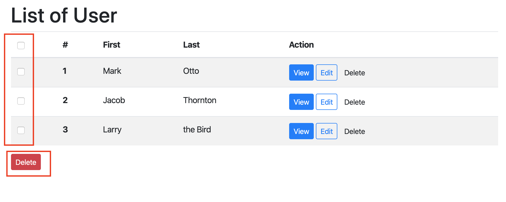

# FRAMEWORK

There are many PHP frameworks like Laravel, Symphony, Code Igniter... In this tutorial, we will learn Code Igniter.

CodeIgniter is an `Model-View-Controller` (MVC) Framework - a toolkit - for people who build web sites using PHP. Its goal is to enable you to develop projects much faster than you could if you were writing code from scratch, by providing a rich set of libraries for commonly needed tasks, as well as a simple interface and logical structure to access these libraries. CodeIgniter lets you creatively focus on your project by minimizing the amount of code needed for a given task.

## Preface 

Before start using Code Igniter (CI), let take a look on `Model-View-Controller` (MVC) concept and `Application Flow Chart`

- [Model-View-Controller](./mvc_model.md)
- [Application Flow Chart](https://codeigniter.com/userguide3/overview/appflow.html)

There are many features in CodeIgniter, we will learn them step by step in Exercise.

## Exercise

This tutorial is intended to introduce you to the CodeIgniter framework and the basic principles of MVC architecture. It will show you how a basic CodeIgniter application is constructed in step-by-step fashion.

**This tutorial will primarily focus on:**

- Model-View-Controller basics
- Routing basics
- Form validation
- Performing basic database queries

More detail, in this tutorial, we'll build a website to manage users, we can Create, Update, View (Read), and Delete a user.

Now, let start:

1. [Install framework](./install.md)
2. [Build index page](./ci_index.md)
3. [Create an User](./ci_create.md)
4. [Updat an User](./ci_update.md)
5. [Delete an User](./ci_delete.md)

## Homework

1. Add colums `phone_number` to table `user`. Update screens `Create` and `Edit`, allow input phone number when create or update user.
2. Make a screen to show all user information. When user click button `View` on Users List, navigate to this screen.
3. Update Users List screen as screen shot. Select users by click the checkboxes, when click on button `Delete` (The red button at bottom of Users List table), delete all selected users.

