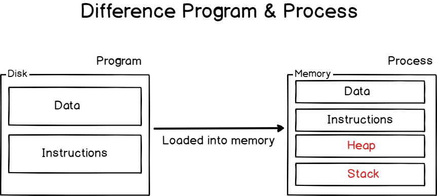
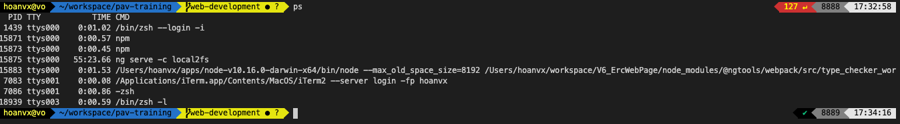
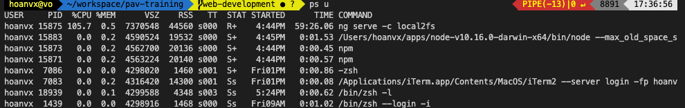
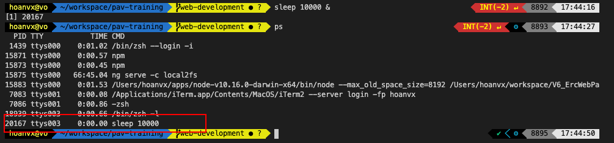

# Overview
This section will cover some basic know about Unix / Linux Operator system. It will help you to best control your machine, the server.

It's also help understand how an application be operated.

# What will you learn
- File permission
- Process
- Port

### 1. [File Permision](https://www.linux.com/tutorials/understanding-linux-file-permissions/)

### 2. Process
A `process is the instance of a computer program` that is being executed by one or many threads

Each process has a process ID (also called `PID`)

> Differene between Program & Process



___ Program ___
 - `program are lines or code or lines of machine instructions` stored on a persistent data storage (hard disk).
 - It can be executed and run as a process.

 ___ Process ___
 - Processes need resources to run: CPU time, memory (such as RAM or disk space), but also virtual memory such as swap space in case your process gets too greedy.

> Identifying running processes on Linux/Unix
- The easiest way to identify running processes on Linux is to run the ps command.
```sh
ps
```
example:


*By default, the ps command will show you the list of the current running processes owned by the current user.*

- To display the processes that are owned and executed by the current connected user, run the following command
```sh
ps u
```


> `Background` and `foreground` processes
- `Background process` is a process that runs in the background, meaning that it is not actively managed by a user through a shell for example.

Example, enter the command `sleep 10000 &` new process was running in the background with PID = 



- `Foreground process` is a process that can be interacted with via direct user input.
Example, enter the command `sleep 10000` in the terminal console. and you can terminate it by press `Ctrl + C`.

Note:
To see your process running, in the context of the current shell, you can execute the jobs command
```sh
jobs
````

> Switch proccess from `background` and `foreground`. use `fg` command

```sh
# list all current jobs (processes of current context (same console)) are running.

sleep 10000 & # create a background job

jobs # list all current jobs, for example there is a job id of above process (sleep 10000)
# [1]  + running    sleep 10000

fg %1
```

> Processes States

`Running` : processes running are the ones using some computational power (such as CPU time) in the current time. A process can also be called “runnable” if all running conditions are met, and it is waiting for some CPU time by the CPU scheduler.

`Stopped` : a signal is stopped is linked to the SIGSTOP signal or to the Ctrl + Z keyboard shortcut. The process execution is suspended and it is either waiting for a SIGCONT or for a SIGKILL.

`Sleeping` : a sleeping process is a process waiting for some event or for a resource (like a disk) to be available.

> Kill process

```sh
kill <pid>

# force to kill 
kill -9 <pid>
```
### 3. Ports

​A port is an addressable network location implemented in an operating system to help differentiate traffic destined for different services or applications. A port is always associated with an IP address of a host and the protocol type for the communication.

​Ports range: `from 1 to 65535`. 

There are different categories of ports.

`0-1023` – are `“Well Known Ports”` associated with services considered as critical or essential. They are also referred to as System Ports.
`1024-49151` – are Registered Ports or User Ports and as the name indicates, can be reserved by sending a request to the Internet Assigned Numbers Authority (IANA).

`49152-65535` – are called Dynamic Ports and are suggested for private use. They also referred to as the Private Ports.

> What is ‘Port Listening’?

A service is said to be “listening” on a port when it is binding to a `port/protocol/IP` address combination in order to wait for requests from clients of the service. Upon receipt of the request, it establishes a one-to-one server client dialog using the same port number.

> Why do you need to know your Open Ports?

Paying attention to which ports are listening on your network is important as open ports can be evidence of an intrusion on your network. Knowledge of the Linux open ports and the kind of information being sent out helps you to thwart malicious efforts aimed at your system. `Knowing this is an important part of securing your system`.
​​
To display the list of open ports, enter the following command –

```bash
lsof -i
```

> there are another ways to find the opened ports, you can research by yourself.


### 4 Environements variable and its scope on unix/linux.
- [Linux environment variable step-by-step](https://likegeeks.com/linux-environment-variables/)


# Reference
http://www.linuxandubuntu.com/home/what-are-ports-how-to-find-open-ports-in-linux
https://devconnected.com/understanding-processes-on-linux/

[Next: Exercise and Homework](./exercise.md)
