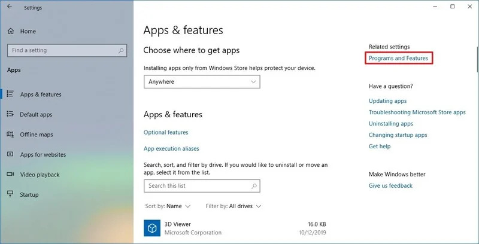
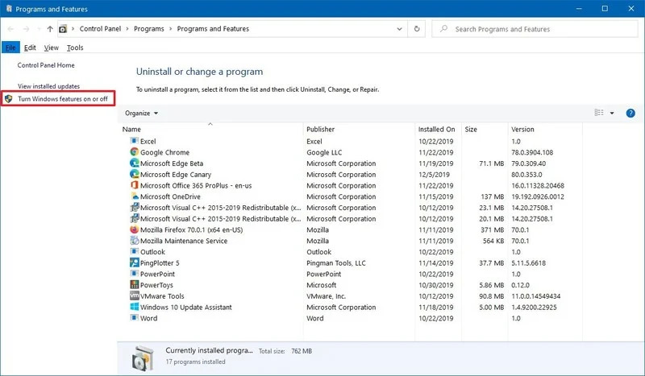
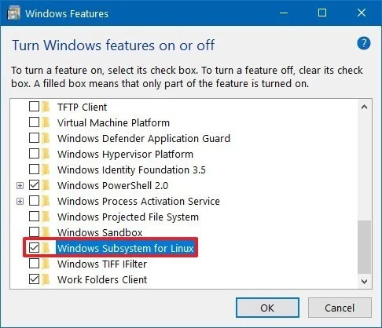
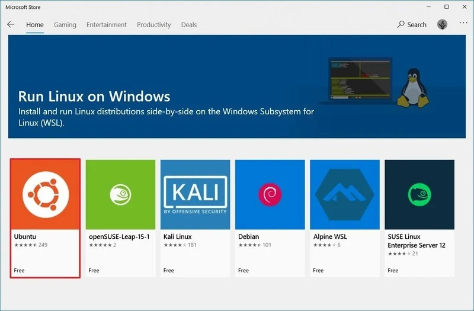
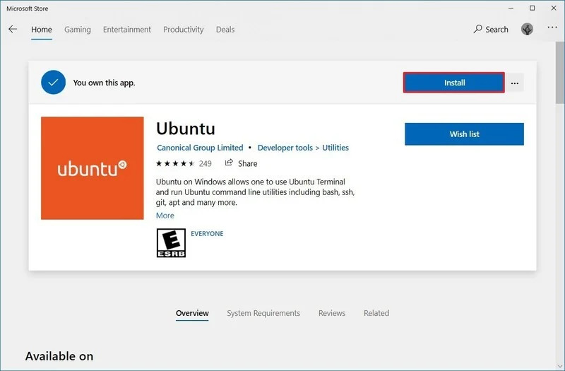
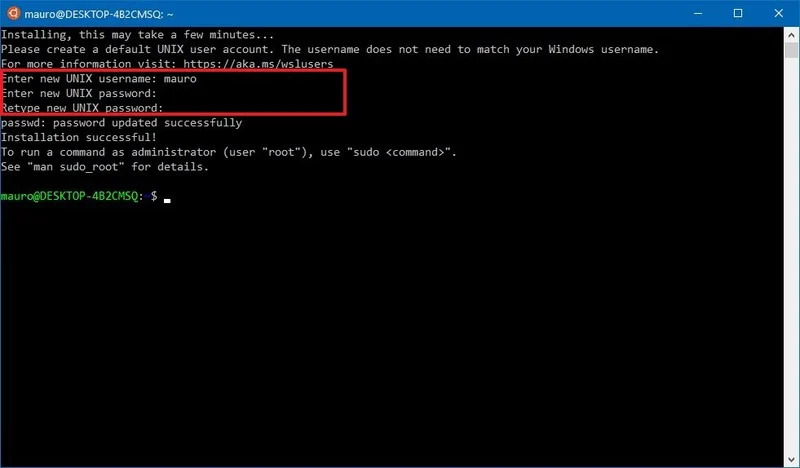

# Overview
Unix / linux server was usually used to host our web application, datatabase, etc. Because they are opensources. We have no extra fee to by the license.

They are ussually no GUI to reduce the size to storage.
So that to interact and control the server you have to use the command lines to interact with the server.

It's `lightweight and fast`

If you are using MacOS or Ubuntu, they are even very help to support you in some cases such as kill the application when it's hang.

# What will you learn
- 37 The common linux commands which often using
- How to install an application, tools in your environment (laptop/pc).

## How to use linux command on Window 10.

To use Linux Commands on Window 10, need to do install Windows Subsystem for Linux.

### 1. Enabling Windows Subsystem for Linux using Settings
1. Open **Settings**.
2. Click on **Apps**.
3. Under the "Related settings" section, click the "Programs and Features" option. 

4. Click the Turn Windows features on or off option from the left pane. 

5. Check the Windows Subsystem for Linux option.

6. Click the OK button.
7. Click the Restart now button.

### Installing Ubuntu distros using Microsoft Store
To install a distribution of Ubuntu on Windows 10, use these steps:
1. Open Microsoft Store.
2. Search with the keyword "Ubuntu" that you want to install.
3. Select the Ubuntu to install on your device.

4. Click the **Get** (or Install) button. 

5. Click the Launch button.
6. Create a username for the Ubuntu and press Enter.
7. Specify a password for the Ubuntu and press Enter.

8. Repeat the password and press Enter to confirm.

*After you complete the steps, you can start using the distro as any other flavor of Linux*

[Next: basic linux command](./linux-command.md)

