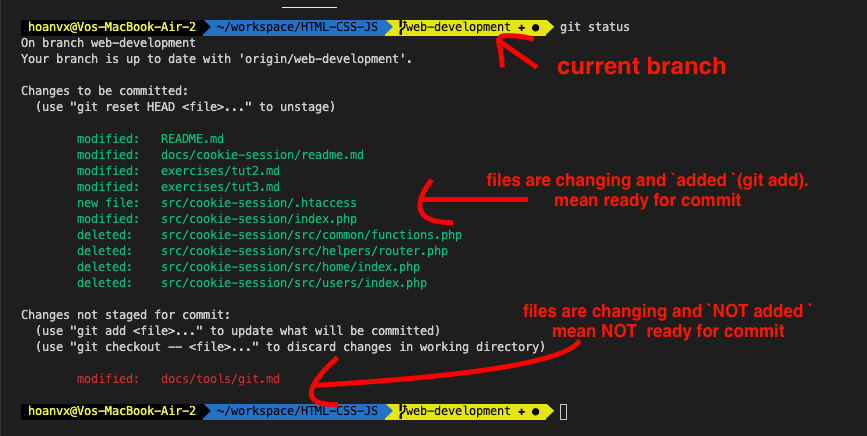
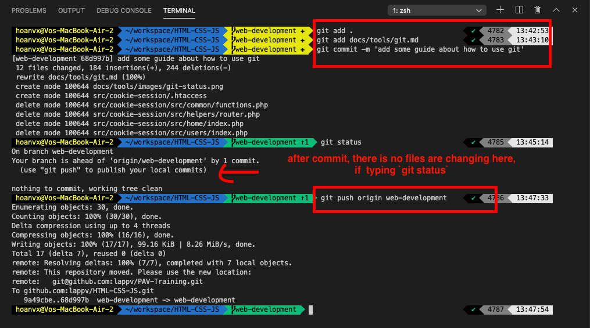
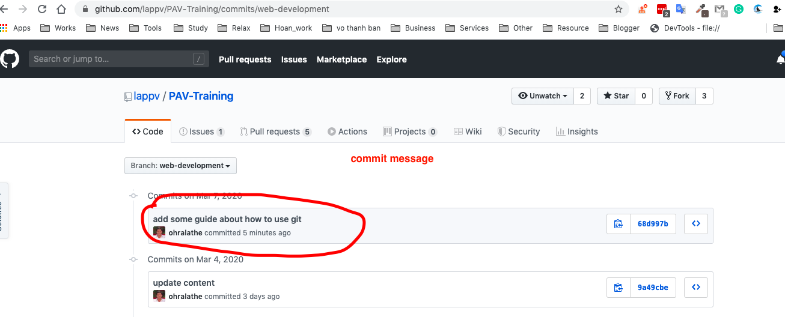

# Basic Commands

## 1. Pull source code from remote to local

First step example in setup git account, we created a repository named `html-css-js`. Access it on github, and copy url


Now, add your project to a remote repository and push your source code onto GitHub repo on the cloud.

```sh
cd ~/workspace/my-webpage

# below commands copied from above image.
echo "# html-css-js" >> readme.md
git init
git add readme.md
git commit -m "first commit"
git remote add origin git@github.com:ohralathe/html-css-js.git
git push -u origin master

```

Or you can clone the repo from GitHub to your local and add new file, and commit it.

```sh
cd ~/workspace

git clone git@github.com:ohralathe/html-css-js.git

cd html-css-js
# below commands copied from above image.
echo "# html-css-js" >> readme.md
git add readme.md
git commit -m "first commit"
git push -u origin master
```

### 2. Use some basic commands
#### 2.1 Create a new branch
```sh
# way 1
git branch your-branch-name

# a new branch <your-branch-name> was created and cloned from current branch and current branch will not switch to new branch


# way 2
git checkout -b your-branch-name

# similar way 1, but it switch to new branch <your-branch-name>
```

**Example:**
```sh
--------- master            # step1. your current branch here
    |                       # step2. git checkout -b branch-1
    | (cloned)
    ----------- branch-1    # step3. now your current branch is branch-1

```

- List all branch at the local

```sh

git branch [option]  # option means can have or not

# offen usage: -v: get more info about last commit and message
# -r: list remote branch

```

> **Note**: every command, you can add `--help` to get more explain
>
> _Example_: `git branch --help`

#### 2.2 View what files are changing
```sh
git status
```

Example:


#### 2.3 `add`, `commit` and `push` the files
`add` is similar to to save a MS Word file which you are editting. 

`commit` is similar to close MS word which your are opend and save it. The files were still at the local
 
`push` is similar to upload the files to the clound which has been saved. In this case, upload your file to remote repository on the cloud

```sh
git add [path-to-file]  # syntax

# ex:
git add . # . mean all files
git add docs/tools/git.md # specific files, each file separate by a space

git commit -m 'your commit message'

# ex:
git commit -m 'add some guide about how to use git'

git push <remote name> <current-branch-name>

# ex:
git push origin web-development

```
example:



After push to remote repository, your update now saved on the cloud (Github) and that content be safe now.



#### 2.4 Switch between branches
```sh
git checkout <branch you want to switch to>

#ex:
git checkout master
```

#### 2.5 Merge content between branches:
```sh
# WAY 1
git merge <branch name> # merge the content from <branch name> into current branch you are staying

# ex, current branch is web-development
git merge master # merge all content of master branch to web-development branch


# WAY 2
git rebase <branch name> # also merge the content from <branch name> to current branch. But it's implement as differnt strategy.

# ex, current branch is web-development
git rebase master.

```

Example about `git merge` and `git rebase`
Below will only explain the `simple scenario` about merge and rebase.

```sh
-------- master
    |      |
    |      |
    -------------- branch-a
           |       (modify and add 1 commit)
           |
           ------- branch-b
                   (modify and add 1 commit)

master (has below commits)
    commit3      2020-01-03
    commit2      2020-01-02
    commit1      2020-01-01


branch-a (has below commits)
    commit4      2020-01-04         # new commit of web-development
    commit3      2020-01-03
    commit2      2020-01-02
    commit1      2020-01-01


branch-b (has below commits)
    commit5      2020-01-05         # new commit of branch-b
    commit3      2020-01-03
    commit2      2020-01-02
    commit1      2020-01-01


# current branch is `master`
git merge branch-b

now `commit5` of branch-b will be clone to new one (same content but different commit id) and copied to master branch

master (has below commits)
    commit5      2020-01-05         # commit copied from branch-b. the copied commit will placed at the top
    commit3      2020-01-03
    commit2      2020-01-02
    commit1      2020-01-01


# because master has new commit, now you want to sync master branch to branch-a to prevent mismatch or out of date.
# current branch is `branch-a`
git rebase master

now `commit5` of master branch will copied (same commit id) to branch-a and place at the bottom of current change (commits) of this branch
branch-a (has below commits)
    commit4      2020-01-04         # new commit of web-development
    commit5      2020-01-05         # commit was rebased from master
    commit3      2020-01-03
    commit2      2020-01-02
    commit1      2020-01-01
```

- Remove files added to git.

  Sometimes, you committed unexpected files to git, so to remove it out of git (but it's still exist your directory), use this command
```sh
git rm --cached <path to file> # you can add -r if path is a directory and you want to remove all files in that directory

```

And mores commands often using
- [Git add](https://git-scm.com/docs/git-add)
- [Git commit](https://git-scm.com/docs/git-commit)
- [Git cherry-pick](https://git-scm.com/docs/git-cherry-pick)
- [Git push](https://git-scm.com/docs/git-push)
- [Git merge](https://git-scm.com/docs/git-merge)
- [Git rebase](https://git-scm.com/docs/git-rebase)
- [Git reset](https://git-scm.com/docs/git-reset)
- [Git log](https://git-scm.com/docs/git-log)
- [Git remote](https://git-scm.com/docs/git-remote)
- [Git init](https://git-scm.com/docs/git-init)
- [Git config](https://git-scm.com/docs/git-config)


> **Reference:**
- [basic overview](https://levelup.gitconnected.com/what-is-git-how-to-use-it-why-to-use-it-explained-in-depth-76a5066abaaa)

# Github flow
*Before starting the exercise and homework, let check carefuly standard github flow at https://guides.github.com/introduction/flow/*


[Next: Exercise and Homework](./exercise.md)