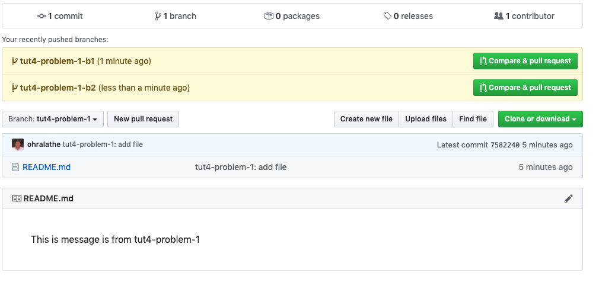
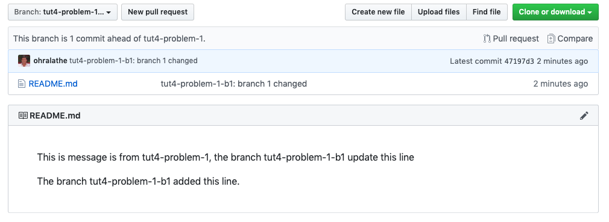
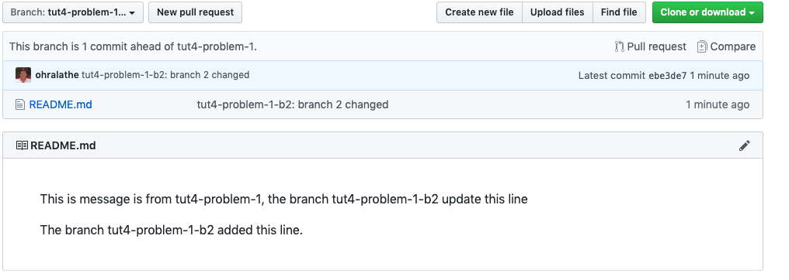
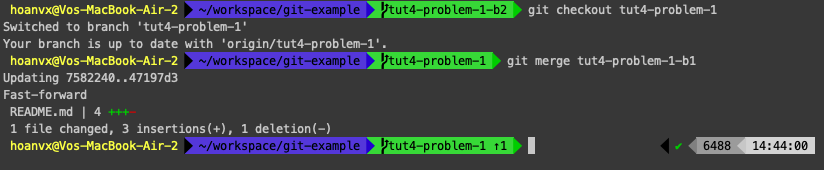
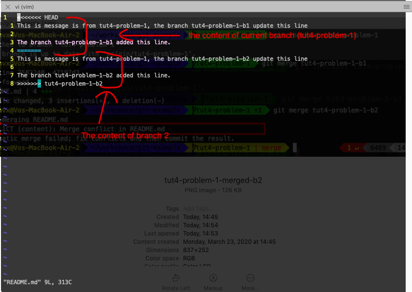
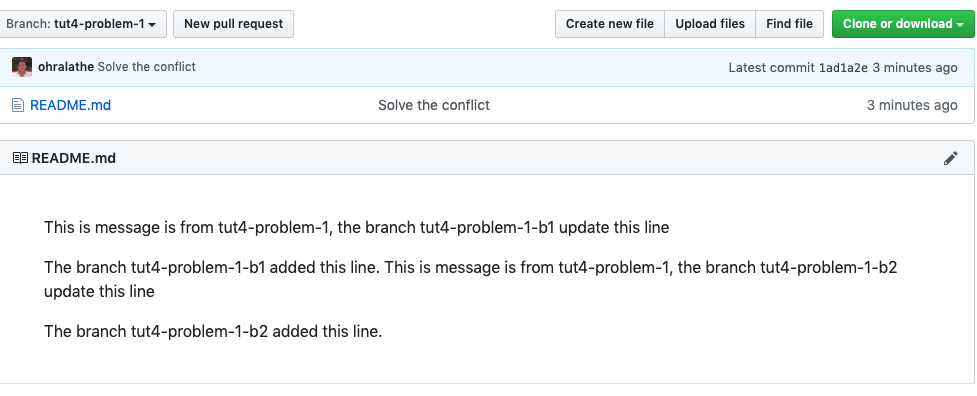
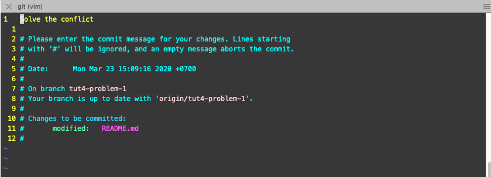

# Exercise

## Problem 1
You do not how use git to manage your source code by command line such add.
- Solve the conflict.
- Change commit messages
- Delete local / remote brach
- Revert to previous version (previous commit)

## Solution

**Please create new repository `git-example` under you repository if it's not creeated**

Here We used repo `git@github.com:ohralathe/git-example.git` was created from previous section. You need to change `git@github.com:ohralathe/git-example.git` to the repository that you have created.

Now, start cloning the sample project and do it.
```sh
cd ~/workspace
git clone git@github.com:ohralathe/git-example.git

cd git-example
git checkout -b tut4-problem-1

# add new readme.md
echo 'This is message is from tut4-problem-1' > readme.md

# push this file to remote repo.

git add .   # add all files in the repo
git commit -m 'File readme.md will be added'
git push origin tut4-problem-1
```

### 1. Solve the conflict
When the conflict occurs?

The conflict occurs when a line of a file have 2 updated from 2 difference branches.

Now, We will create 2 branch and make a change on the same line of the file to make the conflict.

- Create branch 1: `tut4-problem-1-b1`
```sh
# Current branch tut4-problem-1

git checkout -b tut4-problem-1-b1

```

Change the content of file  readme.md from
```txt
This is message is from tut4-problem-1
```

to
```
This is message is from tut4-problem-1, the branch tut4-problem-1-b1 update this line

The branch tut4-problem-1-b1 added this line.
```

Commit and push to remote
```sh
git add -A
git commit -m "tut4-problem-1-b1 update"
git push origin tut4-problem-1-b1
```

- Create branch 2: `tut4-problem-1-b2` from `tut4-problem-1`
```sh
# Checkout to branch tut4-problem-1
git checkout tut4-problem-1

#create new branch from tut4-problem-1
git checkout -b tut4-problem-1-b2
```

Change the content of file  readme.md from
```txt
This is message is from tut4-problem-1
```

to
```
This is message is from tut4-problem-1, the branch tut4-problem-1-b2 update this line

The branch tut4-problem-1-b2 added this line.
```

Push your change to the branch `tut4-problem-1-b2`
```sh
git add -A
git commit -m "tut4-problem-1-b2 update"
git push origin tut4-problem-1-b2
```

After done above steps, your result like this:




Next, merge the content of `tut4-problem-1-b1` to `tut4-problem-1`. Follow the command in the image


Next, merge the content of `tut4-problem-1-b2` to `tut4-problem-1`

```sh
git checkout tut4-problem-1-b2
git checkout tut4-problem-1
git merge tut4-problem-1-b2
```

The conflict occured, now let solve the conlict.

open file and update the content again
```sh
vi readme.md
```


As above conflict, depend on your spec, you can resolve base on below way

- if you want the content from `tut4-problem-1-b2` is latest, you will remove the line: 1 -> 4 and line 8

  ```sh
  <<<<<<< HEAD
  ....
  =======

  # and remove this line
  >>>>>>>> tut4-problem-1-b2
  ```

- if you want the content from `tut4-problem-1-b1` is latest, you will remove lines: 1 and 4 -> 8
  ```sh
  <<<<<<< HEAD
  ....
  =======

  # and remove this line
  >>>>>>>> tut4-problem-1-b2
  ```

- if you want to keep content of both, just remove line 1, 4 and 8.

In this one, I will keep both content. After solve the conflict, type below command to completely solve it.

```sh
git add readme.md
git commit -m 'Solved the conflict'
git push origin tut4-problem-1
```

The result like


### 2. Change commit messages
Sometimes, you have commit but you realized that the commit message is not suitable and you want to change it.

Here is how to do it

```sh
# current branch tut4-problem-1
git commit --amend

# press `i` to enter edit mode and change the message content. (using like vim)
git push origin tut4-problem-1 -f # add -f to force push, because you need to override previous commit id.

```


### 3. Delete local / remote brach
After long time working, you will have many branches at the local.
To save disk space, you should delete unused branch

```sh
# show all local branch
git branch -v

# Delete branch syntax
git branch -D <branch-name>

# ex
git branch -D tut4-problem-1-b1
```

### 4. Revert to previous version (previous commit)

Sometimes, you need to revert previous version because some of reason such as you be requested to develop the feature A for testing something, but after using, your users does not like it, and the product owner want to  revert previous version.

Instead of removing the current source change and replace by the old source code one, You can revert it easily by git.

```sh
# synctax
git reset --hard <the-commit-id>

# ex
git reset --hard 9a49cbe

# to get the commit ID, you can use `git log`
```

# Homework

This homework required teamwork. Let make this homework together with other members.

There is a reposiory included a file `README.md` 
https://github.com/pa-vuhn/introduceyourself

Create a branch with name is your name, add your information at the bottom of the file `README.md` with below format:

```
## Your Name
- DoB: Your Date of Birth
- Email: Your Email
- Hobbies: Your hobbies
```
After that, commit and push your update to the branch that you have created.

When you completed above step, create a pull request and pass the pull request URL to a comment in the ticket on [Trello](https://trello.com/c/48RxTq0x) to ask Supporter review.

If there is any confict, Support will ask you to resolve the conflict and ask them to check the pull request again. After confict is solved, your homework is fished.
