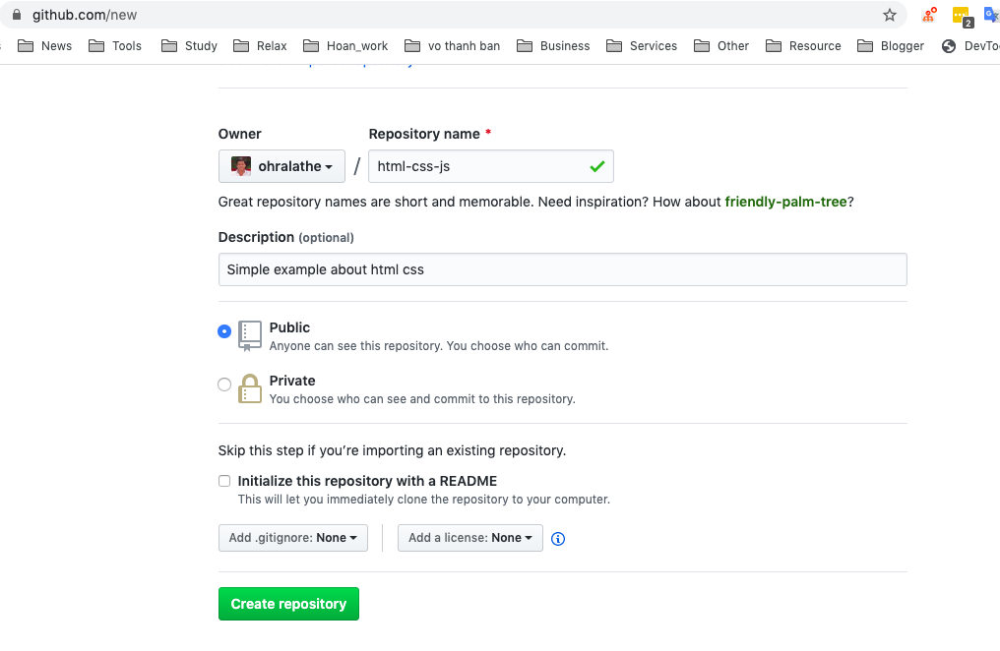
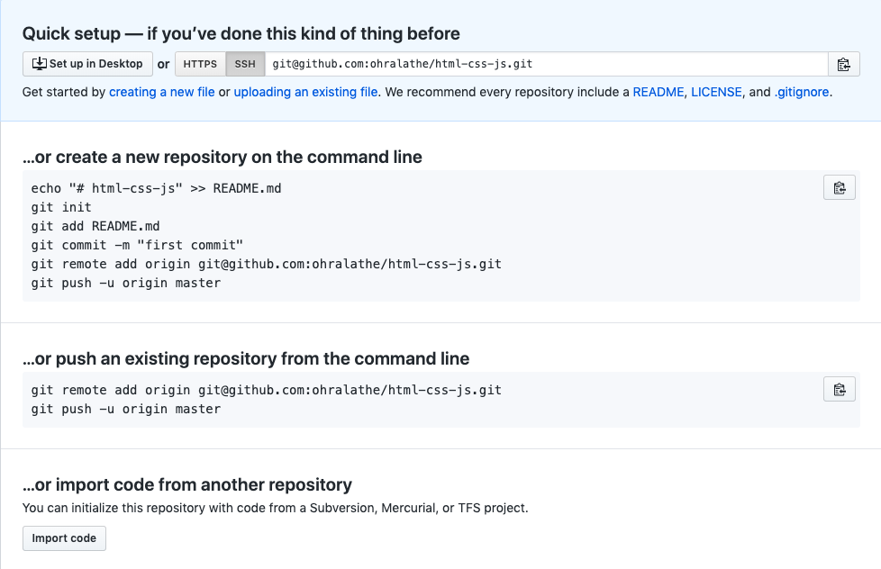
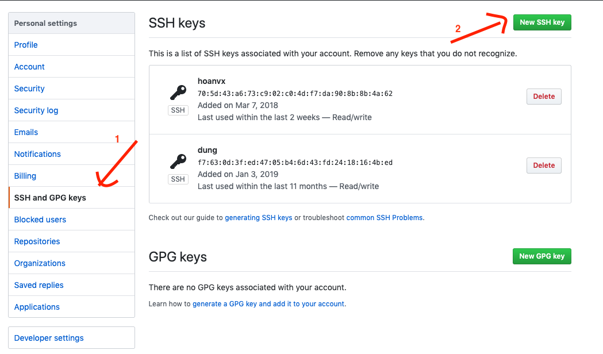
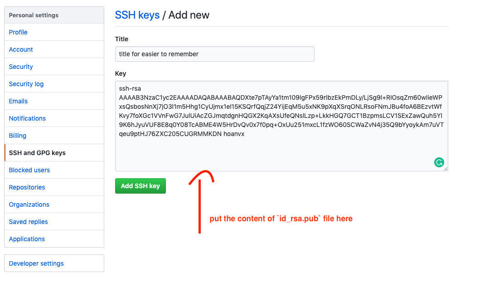

# Overview
- Install git
- Register free Gihub account and create a repository for storage you sources and then connect your local to your github repo
- Some usefull commands which ussualy uses


# How to use.
There are many git services that was implemented from `git` and allow you use without fee (free) such as [GitHub](https://github.com), [GitLab](https://gitlab.com), [Atlassian](https://www.atlassian.com/git)

In this one, We `use Github to make example`. Here is some steps to do that.

- Install Git client
- [Register](https://github.com/) an account
- Create a Git repository
- Add ssh key to allow you pull/push your source code. You can also use the token, or username/pass but, SSH is a good choice
- Pull / Push your source code
- Learn some basic commands often use

### 1. Install Git client

If you are using Mac, ealier version, `git` may be installed by default. You also can open Ubuntu in Window 10 Subsystem that you learned in `linux-command` to use `git` command.

If you are using windows OS, you can download and install git [here](https://git-scm.com/downloads). Just one click.

### 2. Register a Git Account

Access [here](https://github.com/) to register a GitHub account

### 3. Create a git repository.

[Check the guide here](https://help.github.com/en/github/getting-started-with-github/create-a-repo) to create a Git repository


For example, I create a repo `html-css-js`


After created, you'll see a screen like




### 4. Generate SSH key and add to your GitHub account

  Generate SSH key

- Open the Terminal.
- Paste the text below, substituting in your GitHub Enterprise email address.

```sh
$ ssh-keygen -t rsa -b 4096 -C "your_email@example.com"
# This creates a new ssh key, using the provided email as a label.
```
- When you're prompted to "Enter a file in which to save the key," press Enter. This accepts the default file location.

```sh
> Enter a file in which to save the key (/Users/you/.ssh/id_rsa): [Press enter]
# Default is id_rsa

> Enter a file in which to save the key (/home/you/.ssh/id_rsa): [Press enter]
# Default is id_rsa.pub

# At the prompt, type a secure passphrase. For more information, see "Working with SSH key passphrases". (YOU CAN SKIP IT (DO NOT ENTER THE PASSPHRASE))

> Enter passphrase (empty for no passphrase): [Type a passphrase]> Enter same passphrase again: [Type passphrase again]
```

Add you ssh key to GitHub to allow you pull all your repositories

Copy the content of file `id_rsa.pub` to clipboard, use below command (MacOS Only), In windows, you can open the file and copy the content.

```sh
cat ~/.ssh/id_rsa.pub | pbcopy
```

 
 
 

END

[Next: Basic git command](./basic-git-command.md)
