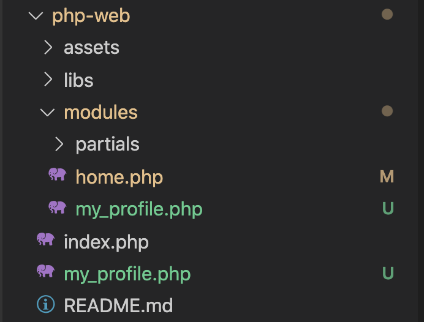
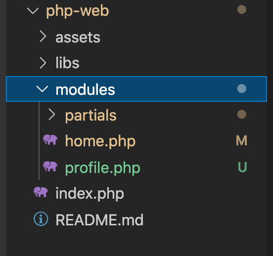

# Loading Pages Dynamically

In first chapter, we only created only home page, in this chapter, we will learn how to add more page for the project.

Before starting, create new git branch from `source-code-structure` to continue:

```sh
git checkout source-code-structure
git checout -b add-profile-page
```

## Add New Page

Before starting create new page, let modify the content of home page. Open file `modules/home.php` and replace `The main content go here` by `This is home page`. The content of `home.php` will be like:

```php
<!-- MAIN content -->
<div id="main">
    <div id="main-content">
        <h3>This is home page.</h3>
    </div>
    <!-- embed sidbar.php -->
    <?php require __DIR__. '/partials/sidebar.php' ?>
</div>
```

Imagine that we need a new page to introduce your selft, the page will be My Profile. We will create a file `profile.php` under the folder `modules`, set the content of `profile.php` as below:

```php
<!-- MAIN content -->
<div id="main">
    <div id="main-content">
        <h3>My profile.</h3>
        <p>Name: Lorem Ipsum</p>
    </div>
    <!-- embed sidbar.php -->
    <?php require __DIR__. '/partials/sidebar.php'; ?>
</div>
```

Note that `modules/profile.php` is just a path (main content) of page, there are no header and footer. In order to show My Profile, we need to make a new page `my_profile.php` at same location with `index.php` to include Header and Footer:

```php
<?php
# Include header
require __DIR__ . '/modules/partials/header.php';
# Include main contain
require __DIR__ . '/modules/profile.php';
# Include footer
require __DIR__ . '/modules/partials/footer.php';
```

After create My Profile page, the source code structure will be:




**Update Main Menu**
Now, we have 2 page: Home and Profile, so that, let update main menu to link to these pages. Let open Header `modules/partials/header.php`, create links to Home and My Profile by change below content:

```html
<nav>
    <ul>
        <li>Menu 1</li>
        <li>Menu 2</li>
        <li>Menu 3</li>
        <li>Menu 4</li>
    </ul>
</nav>
```

to:

```html
<nav>
    <ul>
        <li><a href="./index.php">Home</a></li>
        <li><a href="./my_profile.php">My Profile</a></li>
    </ul>
</nav>
```

Now, let access to http://localhost/php-web/my_profile.php to see page My Profile.

## Improve Source Code by Loading Pages Dynamically.

Take a look on `index.php` and `my_profile.php`, their source code is almost same, except including main content path. `home.php` uses `modules/home.php`, and `my_profile.php` uses `modules/profile.php`. 

Is it posible if we only use `index.php` to load other main contents like `home.php` or `profile.php` to avoi repeating same source code? The answer is yes, let do it following step

Because we only use `index.php` to load other pages dymamically, so that, let delete `my_profile.php` under the folder `php-web`. The folder structure after deleted `my_profile.php` will be:



### How to load pages dynamically by only using index.php?

Take a look again on source code of `index.php`

```php
<?php
# Include header
require __DIR__ . '/modules/partials/header.php';
# Include main contain
require __DIR__ . '/modules/home.php';
# Include footer
require __DIR__ . '/modules/partials/footer.php';
```

We will see that, it always uses file `modules/home.php` for main content. We will change it to able to load other pages by a magic thing in PHP: It is `$_GET`.

`$_GET` is a super global variable in PHP, we can use in at anywhere in our source code. 

`$_GET` is used for collecting data sent in the URL.

Example, the URL is `http://http://localhost/php-web/index.php?m=profile`, if you use below source code in `index.php`

```php
<?php
echo $_GET['m'];
```
The output will be `profile`. And `?m=profile` usualy called `get param`

Another example, if you access to URL `http://http://localhost/php-web/index.php?m=profile&param1=value1&param2=value2`, and inside of `index.php`, we can use `get params`:

```php
<?php
echo $_GET['m']; // Output profile
echo $_GET['param1']; // Output value1
echo $_GET['param2']; // Output value2
```

We known how to use `$_GET`, and we can use it to load other pages dymically by use `get params`. Example, when the URL is `http://http://localhost/php-web/index.php` without any get param, we will use `modules/home.php`, if the URL is `http://http://localhost/php-web/index.php?m=profile`, we will use `module/profile.php` for main content. If we want to create more pages, the idea is same.

Now, let implement it in `index.php`.

```php
<?php
// Get modules need to use for main content by using $_GET
$module = $_GET['m'];

// If there is no get param to load page, set $module default to home page
if ($module == null) {
    $module = 'home';
}

# Include header
require __DIR__ . '/modules/partials/header.php';
# Include main contain

require __DIR__ . "/modules/$module.php";

# Include footer
require __DIR__ . '/modules/partials/footer.php';

```

After updated `index.php`, you can access to Home page by URL `http://localhost/php-web/index.php` and My Profile page by URL`http://localhost/php-web/index.php?m=profile`


Because the URL of My Profile page is changed, let open `modules/partials/header.php` to fix the menu by changing:

 ```html
 <li><a href="./my_profile.php">My Profile</a></li>
 ```
 To:

 ```html
 <li><a href="./index.php?m=profile">My Profile</a></li>
 ```

You have completed adding a page, push the changes to remote repository.

```sh
git add -A
git commit -m "add my profile"
git push oringin add-profile-page
```

## Conclusion

In this chapter, we learned how to implement pages for the website without repeating source code. Remember that Don't Repeate Yourself (DRY) is a important idea when implementing source code. It is easier to maintain your source code in future.

[Next: Using PHP to render HTML content](./php-render-html.md)
