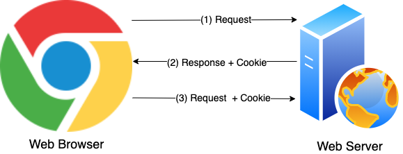
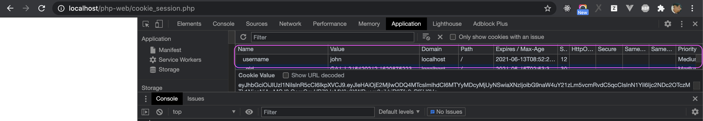

# Cookie And Session In PHP

Before starting, create new git branch

```sh
git checkout php-mysql
git checkout -b cookie-session
```

## Cookie

### What is a Cookie?

A cookie is a small file with the maximum size of 4KB that the web server stores on the client computer.



- (1): Browser request to a PHP Web Page (Web Server)
- (2): The web server sets the cookie on the user’s computer
- (3): Other requests from the browser will include the cookie name and value.

The maximum size of a cookie is 4KB

By default, a cookie can only be read from the domain that it has been issued from. For example, a cookie is issued by http://abc.com only can read from http://abc.com, and CAN NOT be read from another domain like http://def.com

### When we shoule use cookie

We can use cookie to store some NOT SECURE data on browser, example when you access a web page to login, you need to input email and password, in this case, we can store the email in cookie, and next time, when you access the page, email will be filled automatically by get it from the cookie.

### How to Set and Get (Receive) a Cookie by PHP

#### Set a cookie on web browser by using PHP

In order to set a cookie by PHP, we use function `setcookie` with the syntax:

```php
<?php
setcookie('name', 'value', 'expire', 'path', 'domain', 'secure', 'httponly');
?>
```

- `name`: is name of cookie, it is a required param, orthers is optional.
- `value`: The value of the cookie. This value is stored on the clients computer; DO NOT store sensitive information like password, credit card information...
- `expire`: The time the cookie expires, tshis is a Unix timestamp. Example we set expire is `time() + 60*60*24*30`, means that cookie will expire after 30 days.
- `path`: The path on the server in which the cookie will be available on. If set to `/`, the cookie will be available within the entire domain. If set to `/foo/`, the cookie will only be available within the `/foo/` directory and all sub-directories such as `/foo/bar/` of domain. The default value is the current directory that the cookie is being set in.
- `domain`: The (sub)domain that the cookie is available to. Setting this to a subdomain (such as 'www.example.com') will make the cookie available to that subdomain and all other sub-domains of it (i.e. w2.www.example.com). To make the cookie available to the whole domain (including all subdomains of it), simply set the value to the domain name ('example.com', in this case).
- `secure`: Indicates that the cookie should only be transmitted over a secure HTTPS connection from the client. When set to true, the cookie will only be set if a secure connection (https) exists.
- `httponly`: When `true` the cookie will be made accessible only through the HTTP protocol. This means that the cookie won't be accessible by scripting languages, such as JavaScript.

For example, with below syntax, we will set a cookie with name is `username`, `value` is `john`, expire time is 30 days (30*24*60*60 is seconds coresponding with 30 days), a `path` is `/`.

```php
<?php
setcookie('username', 'john', time() + 30*24*60*60, '/');
```

You can create a page `cookie.php` under the folder `php-web` to check it.

```php
<?php
// File cookie.php
setcookie('username', 'john', time() + 30*24*60*60, '/');
?>
```

You can check the result by access http://localhost/php-web/cookie.php. It is a blank page, but you can check it by click right mouse on the page, select  Inspect -> Select Application -> Select Cookies, you will see the cookie was set like screenshot.



#### Get a Cookie by PHP

To get a cookie, we use Supper Global Varibale `$_COOKIE` with syntax `$_COOKIE['cookie_name']`, for example, in order to get cookie `username` was set above, we use `$_COOKIE['username']`

You can use file `cookie.php`, and try to do:
- Check if cookie `my_email` is not set, set cookie `my_email`
- Check if cookie `my_email` was set, get and show cookie on screen.

You can do it by following below source code

```php
<?php
$cookieName = 'my_email';
$cookieValue = 'john@example.com';

// isset is a function to check a varibale is exist or not
if (!isset($_COOKIE[$cookieName])) {
    // Set cookie
    setcookie($cookieName, $cookieValue, time() + 30*24*60*60, '/');
    echo "Set cookie: name=$cookieName, value=$cookieValue";
} else {
    // get cookie
    $email = $_COOKIE[$cookieName];
    echo "Cookie $cookieName has value $email";
}
?>
```

When you access to the page for first time, you will see message `Set cookie: name=my_email, value=john@example.com`, and when you access the page from 2nd time, you will see the message `Cookie my_email has value john@example.com`

# Session

### What is session?

A session is a way to store information (in variables) to be used across multiple pages. By default, value of the session will be stored in a file on server. When session created, it also send back the ID of the Session to browser, it is called Session ID. The Session ID is stored in cookie on browser.

### When we will use session

Because of HTTP is stateless, mean that server don't know who is request to the website. In order to indentify who are using the website, we use the session. 

More detail, you can use session:

- When you want to store temporarity data until browser closed, because session ends when the user closes the browser.
- When you want to store SECURE data.s

### Using PHP Session

A session is started with the `session_start()` function.

**Note: The `session_start(`) function must be stay on the top of your php files, before any HTML tags.**

To Register or Receive a session, we use Supper Golobal Variable ` $_SESSION`

More detail, to set a session use syntax `$_SESSION['session_name']= "session value"`. To receive a session use syntax `$_SESSION['session_name']`

Now, create new file `session.php` under the folder `web-php`, in this page, try to start session, set and get value of the session and show on screen.


```php
<?php
// Start the session at the top of page
session_start();
?>
<!DOCTYPE html>
<html>
<body>

<?php
$sessionName = 'cart';
$sessionValue = 'dress,watch';

// check if session not exist, create it
if (!isset($_SESSION[$sessionName])) {
    // Set session
    $_SESSION[$sessionName] = $sessionValue;
    echo "Set session: name=$sessionName, value=$sessionValue";
} else {
    // get session
    $cart = $_SESSION[$sessionName];
    echo "Sesion $sessionName has value $cart";
}
?>

</body>
</html>

```

Access to http://localhost/php-web/session.php, in first time you will see `Set session: name=cart, value=dress,watch`, and from 2nd time, you will see `Sesion cart has value dress,watch`. Remember that you can get session from other page, you can create new file like `test_session.php` and try it.

In order to destroy sessions, use the function `session_destroy()`

Finnaly, push all changes to remote repository.

```sh
git add -A
git commit -m "cookie and session"
git push origin cookie-session
```

## Conclusion

Cookie and Session seems almost same, but they are not same. Session is stored in server and Cookie is stored in browser. And Session will be end when browser closed, Cookie end when it expired by setting when we set it.

Session and Cookie is usually used in Implementing web site. In next chapter, we will apply them for user authentication (user login).

[Next: Register and Login](./register_login.md)
