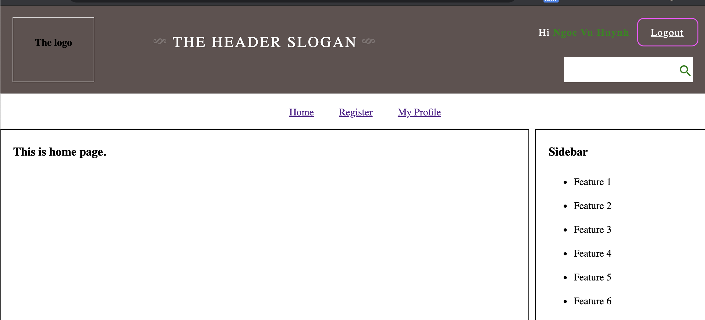
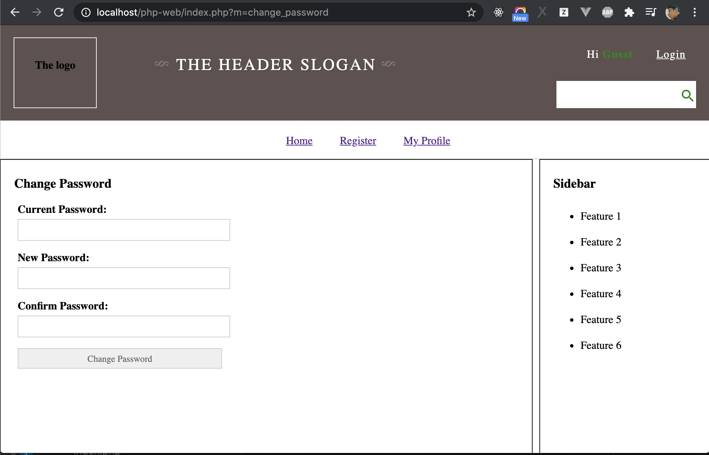

# Homework

## Homework 1 (Easy)

- Make Logout function, when user click on `Logout`

## Homework 2 (Easy)

 Look at main menu, there are 3 item `Home`, `Register` and `My Profile`. Please show them with conditions:

- If user Logged in, hide menu `Register`, only show `Home` and `My Profile`
- If user not logged-in, hide `My Profile`, only show `Home` and `Register`

## Homework 3 (Easy)

Update page `Register` with requirement: if a logged in user access to page `Register`, redirect to homepage. If not not logged in, show `Register` page.

## Homework 4 (Normal)

Update page `My Profile` with requirement: 
- If not logged-in user access to `My Profile`, browser will redirect to `Login`.
- If logged-in user access to `My Profile`, show information of this user such as: ID, Fullname, Username, Email.

## Homework 5 (Normal)

Make a new page to change password with below requirement:

- Title of this page is `Change Pasword`
- If user is not logged-in, redirect to `Login`
- If user logged-in, show form to update password with 3 fiels: Current Password, New Password, and Confirm New Password. When user inputed correct Current Password AND New Password is the same with Confirm Password, process to update password of the user to New Password. If not, show corresponding error.
- Add new menu `Change Password`, this menu only show when user logged in.

### Homework 6 (Normal)

Update Home page with below requirement:

- If user is not logged-in, show message `Welcome to the website! Login to see users list`
- If user is logged-in, show users list on homepage.
