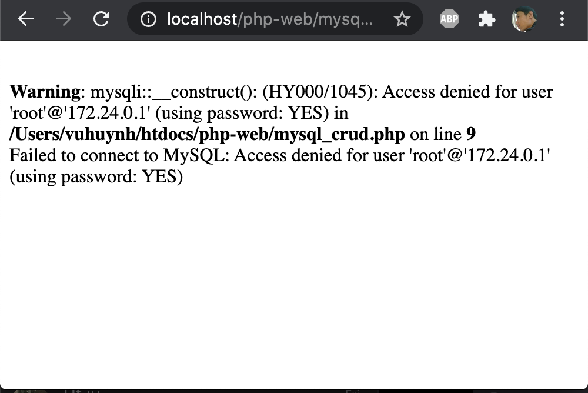
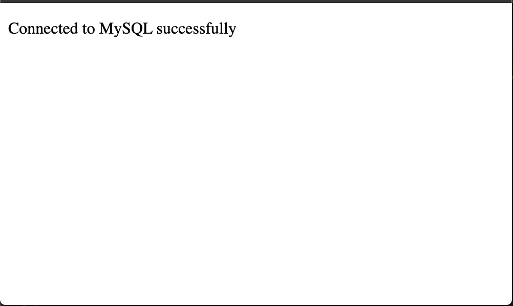
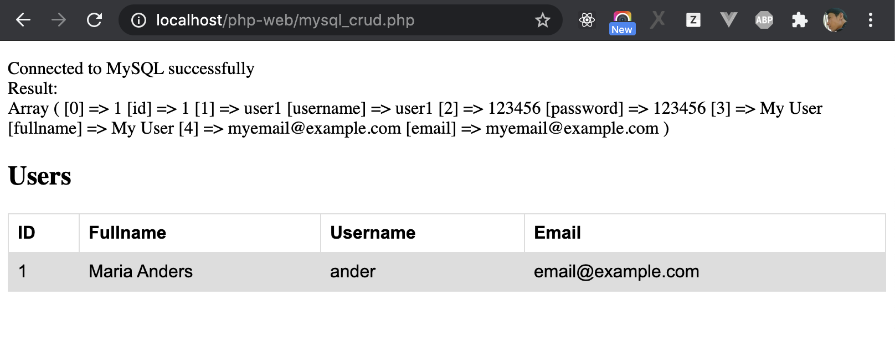
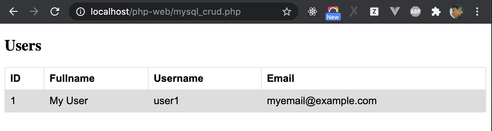
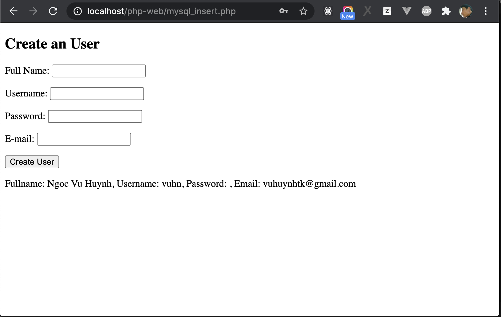
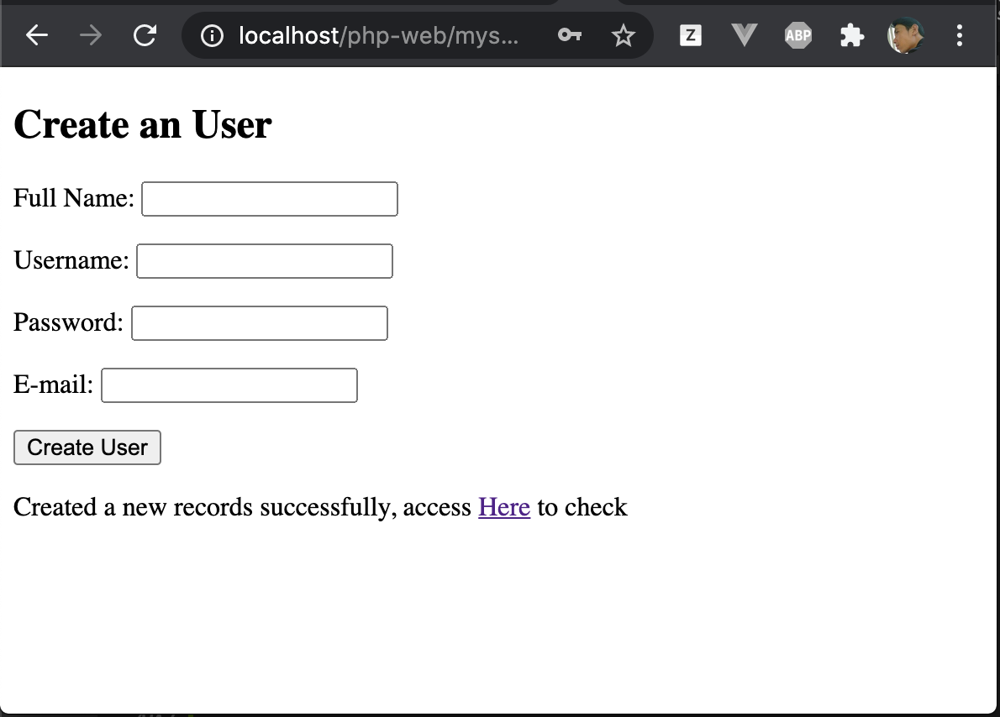
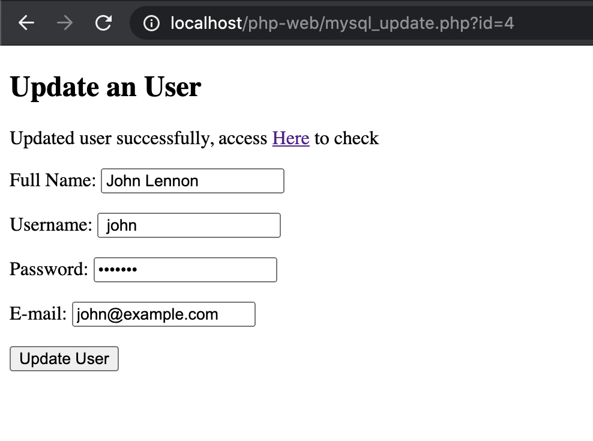
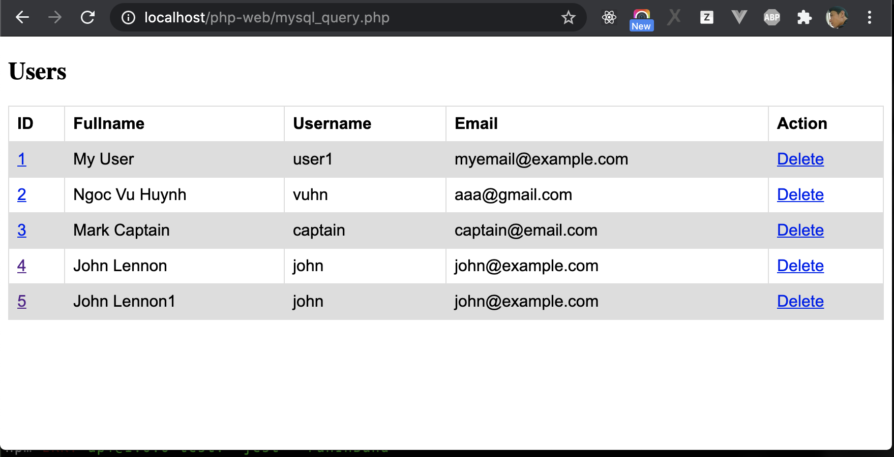
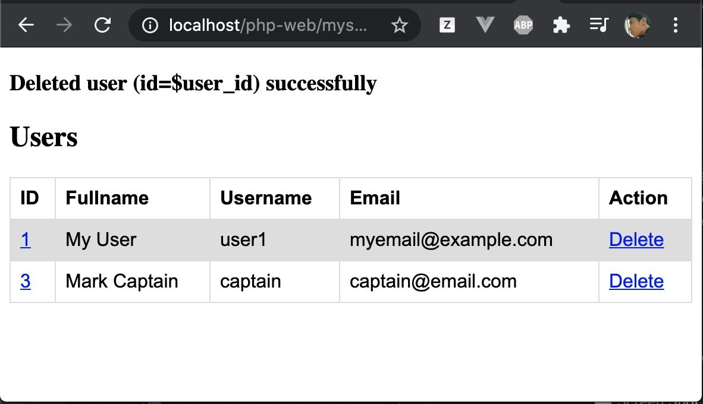

# PHP and MySQL

In this chapter, we will learn how to use PHP to Connect to MySQL, and perform action create, update, insert, update, delete data.

Before statring, let create new git branch for learning this chapter.

```sh
git checkout php-render-html
git checkout -b php-mysql
```

**Note: if you still didn't learn Database part, you need to learn it before continue**

## Preapare: Create database and Table

Before starting, we need to create new database `php_web` by execute below query:

```SQL
CREATE DATABASE /*!32312 IF NOT EXISTS*/ `php_web` /*!40100 DEFAULT CHARACTER SET utf8 */
```

And we also need to create a table, to learn how to insert, update, read, delete data. Select database `php_web` and excute below query:

```SQL
CREATE TABLE `users` (
  `id` int(11) unsigned NOT NULL AUTO_INCREMENT,
  `username` varchar(50) NOT NULL DEFAULT '',
  `password` varchar(100) NOT NULL DEFAULT '',
  `fullname` varchar(255) NOT NULL DEFAULT '',
  `email` varchar(255) NOT NULL DEFAULT '',
  PRIMARY KEY (`id`)
) ENGINE=InnoDB DEFAULT CHARSET=utf8;
```

Insert an record to table `users` by excuting below query:

```SQL
INSERT INTO users(`username`, `password`, `fullname`, `email`) VALUE ('user1', '123456', 'My User', 'myemail@example.com')
```


## Create A Connection To MySQL

In order to connect with MySQL, we use MySQLi. MySQLi is a native php exestion that allows you to access to MySQLi

Open a new connection to the MySQL server as below:

```php
$connection = new mysqli("localhost", "username", "password", "database");
```

In above source code:
`localhost`: is MySQL database host name or IP address
`username`: is database username, example `root`
`password`: is database password, example `123456` or can be empty string.
`database`: is database name, example database name is `web_php` that you have created above


Now, let create new file `mysql_connect.php` under the folder `php-web` and try to connect to MySQL Server.

```php
<!DOCTYPE html>
<head>
    <title>PHP MySQL</title>
</head>
<body>
    <p>
        <?php
            $connection = new mysqli("localhost", "root", "root_password", "php_web");
            // connect_error is a properties of connection, it's null if there is no error
            if ($connection->connect_error != null) {
                echo "Failed to connect to MySQL: " . $connection->connect_error;
            } else {
                echo "Connected to MySQL successfully";
                $connection->close();
            }
        ?>
    <p>
</body>
</html>
```

If you set an incorrect MySQL password, the connection to MySQL Server will be failed. When you access to `http://localhost/php-web/mysql_connect.php`, the result will be like:



If you set MySQL host name, username, password and database name correctly , when you access to `http://localhost/php-web/mysql_connect.php`, the ouput on screen will be like:



## Excute SQL Queries

Above section, we now how to connect to MysSQL server, now, we will try to execute MySSQL Quries

### Execute Query To Get Data

Before excute query to get data, make a file `mysql_query.php` at same location with `mysql_connect.php` to show data as below (it included mysql connection that we created above, we will use it to query data.)

```php
<!DOCTYPE html>
<head>
    <title>PHP MySQL</title>
    <style>
        table {
        font-family: arial, sans-serif;
        border-collapse: collapse;
        width: 100%;
        }

        td, th {
        border: 1px solid #dddddd;
        text-align: left;
        padding: 8px;
        }

        tr:nth-child(even) {
        background-color: #dddddd;
        }
    </style>
</head>
<body>
    <p>
        <?php
            $connection = new mysqli("localhost", "root", "root_password", "php_web");
            // connect_error is a properties of connection, it's null if there is no error
            if ($connection->connect_error != null) {
                echo "Failed to connect to MySQL: " . $connection->connect_error;
            } else {
                echo "Connected to MySQL successfully";
                $connection->close();
            }
        ?>
    <p>

    <h2>Users</h2>

    <table>
        <tr>
            <th>ID</th>
            <th>Fullname</th>
            <th>Username</th>
            <th>Email</th>
        </tr>
        <tr>
            <td>1</td>
            <td>Maria Anders</td>
            <td>ander</td>
            <td>email@example.com</td>
        </tr>
    </table>
</body>
</html>
```

After created HTML to show data, we will learn how to get data from MySQL by executing a query. In order to excute a query, and get return data from the query, let change php source code in `mysql_query.php` to below:

```php
<!DOCTYPE html>
<head>
    <title>PHP MySQL</title>
    <style>
        table {
        font-family: arial, sans-serif;
        border-collapse: collapse;
        width: 100%;
        }

        td, th {
        border: 1px solid #dddddd;
        text-align: left;
        padding: 8px;
        }

        tr:nth-child(even) {
        background-color: #dddddd;
        }
    </style>
</head>
<body>
    <p>
        <?php
            $connection = new mysqli("localhost", "root", "root_password", "php_web");
            // connect_error is a properties of connection, it's null if there is no error
            if ($connection->connect_error != null) {
                echo "Failed to connect to MySQL: " . $connection->connect_error;
            } else {
                echo "Connected to MySQL successfully";
                $connection->close();
            }
            // Define a sql query
            $sql_query = "SELECT * FROM users";
            // Call method query of the object $connection to execute a query
            $result = $connection->query($sql_query);

            if ($result->num_rows > 0) {
                echo "<br>Result: <br>";
                // output data of each row
                while($row = $result->fetch_array()) {
                    print_r($row);
                }
            } else {
                echo "0 results";
            }
        ?>
    <p>

    <h2>Users</h2>

    <table>
        <tr>
            <th>ID</th>
            <th>Fullname</th>
            <th>Username</th>
            <th>Email</th>
        </tr>
        <tr>
            <td>1</td>
            <td>Maria Anders</td>
            <td>ander</td>
            <td>email@example.com</td>
        </tr>
    </table>
</body>
</html>
```

Explaination for above source code:

- `$connection`: we learned at above section, it a MySQL connection.
- `$result = $connection->query($sql_query)`: the syntax to execute a SQL Query and puts the resulting data into a variable called $result. `$sql_query` is a SQL Query string.
- `$result->num_rows`: return number of rows returned by SQL Query.
`$row = $result->fetch_array()`, the method `fetch_array` return an array coresponding with a row in MySQL. The `while` will loop though each row in result.


Access to the URL `http://localhost/php-web/mysql_connect.php` to check the result, you will see the result ouputed on the screen. It is a record that you inserted to table `users`, if you inserted more records, you will see that there is more rows



Now, you know how to get rows from MySQL to an array, now let output the array to the table. We leaned how to use PHP to render HTML content at previous lesion. Now let use the varible `$result` to do it, change body    of of `mysql_query.php`:

```php
<body>
<?php
    $connection = new mysqli("localhost", "root", "root_password", "php_web");
    // if connection is error, ouput error message on screen and do stops
    if ($connection->connect_error != null) {
       echo "<p>Failed to connect to MySQL: " . $connection->connect_error . '</p>';
    } else { // If there is no error, process to select and show data
        // Define SQL Query to select data from MySQL
        $sql_query = "SELECT * FROM users";
        // Call method query of the object $connection to execute a query
        $result = $connection->query($sql_query);
?>
    <h2>Users</h2>

    <table>
        <tr>
            <th>ID</th>
            <th>Fullname</th>
            <th>Username</th>
            <th>Email</th>
        </tr>
        <?php if ($result->num_rows > 0) { 
            while($row = $result->fetch_array()) { ?>
                <tr>
                    <td><?php echo $row['id'] ?></td>
                    <td><?php echo $row['fullname'] ?></td>
                    <td><?php echo $row['username'] ?></td>
                    <td><?php echo $row['email'] ?></td>
                </tr>
            <?php } // end while ?>
        <?php } // end if ?>
    </table>
<?php } //end of if for handling connection error ?>
</body>
```

Access the URL http://localhost/php-web/mysql_query.php again, the ouput will be like below screenshot:




### Execute Query To Insert Data

Above section, we've learned how to select data from MySQL by using PHP, in this section, we'll learn how to insert a record to MySQL by using PHP.
#### Create PHP Form To Submit Data

In order to create Data, we create a HTML form to input and submit data to PHP (you learned how is form work in HTML program), now create file `mysql_insert.php` and create a form as below:

```html
<!DOCTYPE html>
<head>
    <title>PHP MySQL - Insert Data</title>
</head>
<body>
    <h2>Create an User</h2>
    <form action="./mysql_insert.php" method="post">
        <p>Full Name: <input type="text" name="fullname"></p>
        <p>Username: <input type="text" name="username"></p>
        <p>Password: <input type="password" name="password"></p>
        <p>E-mail: <input type="text" name="email"></p>
        <p><input type="submit" value="Create User"></p>
    </form>
</body>
</html>
```
`<form action="./mysql_insert.php" method="post">`: please take a look at this line. `action="./mysql_insert.php" method="post">`: it means that data in the form like `fullname, username, password, email` will be send to `mysql_insert.php` (we will submit data to this file). `method="post"`: mean that we submit via method `POST`.  

But how to receive submited data from ? It's very easy, PHP provided us a Support Global Variable `$_POST` to receive `post data`. The syntax to receive data is `$_POST['input name']`. Form example:

```php
// To receive username submited from the form and assign it to varibale $username
$username = $_POST['username'];
echo $username;

// Revcei email
$username = $_POST['email'];
echo $email;
```

Now, let try receive form data by update `mysql_insert.php`

```php
<!DOCTYPE html>
<head>
    <title>PHP MySQL - Insert Data</title>
</head>
<body>
    <h2>Create an User</h2>
    <form action="./mysql_insert.php" method="post">
        <p>Full Name: <input type="text" name="fullname"></p>
        <p>Username: <input type="text" name="username"></p>
        <p>Password: <input type="password" name="password"></p>
        <p>E-mail: <input type="text" name="email"></p>
        <p><input type="submit" value="Create User"></p>
    </form>
    <!-- Check if there is submiting data from form, receive and output to screen -->
    <?php
    // check if form is submited
    if (!empty($_POST)) {
        // Receive data by using $_POST
        $fullname = $_POST['fullname'];
        $username = $_POST['username'];
        $password = $_POST['password'];
        $email = $_POST['email'];
        echo "<p>Fullname: $fullname, Username: $username, Password: $password, Email: $email</p>";
    }
    ?>  
</body>
</html>
```

After modified file `mysql_insert.php` following above, let access the URL http://localhost/php-web/mysql_insert.php, input Fullname, Username, Password, Email to the form and click button `Create User`, you will that they will be outputed to screen




## Insert Data to MySQL

After revceived data from form, let use PHP to insert the data to MySQL. It is totally same with selecting data (create a connection, and use this connection to execute the query.) Let do it as below by updating `mysql_insert.php`

```php
<!DOCTYPE html>
<head>
    <title>PHP MySQL - Insert Data</title>
</head>
<body>
    <h2>Create an User</h2>
    <form action="./mysql_insert.php" method="post">
        <p>Full Name: <input type="text" name="fullname"></p>
        <p>Username: <input type="text" name="username"></p>
        <p>Password: <input type="password" name="password"></p>
        <p>E-mail: <input type="text" name="email"></p>
        <p><input type="submit" value="Create User"></p>
    </form>
    <!-- Check if there is submiting data from form, receive and output to screen -->
    <?php
    // check if form is submited
    if (!empty($_POST)) {
        $fullname = $_POST['fullname'];
        $username = $_POST['username'];
        $password = $_POST['password'];
        $email = $_POST['email'];
        
        // Create MySQL connection
        $connection = new mysqli("localhost", "root", "", "php_web");
        // if connection is error, ouput error message on screen and do stops
        if ($connection->connect_error != null) {
            echo "<p>Failed to connect to MySQL: " . $connection->connect_error . '</p>';
        } else {
            // define sql query to insert data
            $sql = "INSERT INTO users(`fullname`, `username`, `password`, `email`) VALUE ('$fullname',' $username', '$password', '$email')";
            // use connection to execute the query
            if (!$connection->query($sql)) {
                // If insert failed, show error.
                echo "<p>Failed to insert data. Error: " . $connection->error. "</p>";
            } else {
                // If created successfully, show message and link to mysql_query.php to check the users list
                echo '<p>Created a new records successfully, access <a target="_blank" href="./mysql_query.php">Here</a> to check</p>';
            }
        }
    }
    ?>  
</body>
</html>
```

Now, let access the URL http://localhost/php-web/mysql_insert.php, fill data to the form and click "Create User" you can see the result will be like:



If you go to page http://localhost/php-web/mysql_query.php, you will see that new record has been created with the information is what you filled in the form above.

### Execute Query To Update Data

After leanred how to create an user. Now we will learn how to update an user. The idea to update an user as below:
1. Update page users list `mysql_query.php`: add link to ID of user, if click on ID, it will be navigate to new page to update user `mysql_update.php`.
2. On the page `mysql_update.php`, we made a form to show current user information. At this form, we can change the information like Fullname, Email... and submit form.
3. After form was submited, we user Supper Global Variable `$_POST` to receive submited data.
4. Execute query to update the user with the received data.


Step 1:  let update the page `mysql_query.php`, add a link to ID by repalcing `<td><?php echo $row['id'] ?></td>` to `<td><a href="./mysql_update.php?id=<?php echo $row['id'] ?>"><?php echo $row['id'] ?></a></td>`. Take a look at link `./mysql_update.php?id=<?php echo $row['id'] ?>"`, there is a get param `?id=`, this param will be used for indenfiying what is the user need to update.

Step 2: Note that we still didn't create the page `mysql_update.php` for updating data. But before update data, let create a form and load current user information to the form (you already learned how to query data at above section).

```php
<!DOCTYPE html>
<head>
    <title>PHP MySQL - Update Data</title>
</head>
<body>
    <h2>Update an User</h2>
    <?php
        // Define user ID that you want to update
        $user_id = $_GET['id'];

        // Create MySQL Connection
        $connection = new mysqli("localhost", "root", "", "php_web");

        // if connection is error, ouput error message on screen
        if ($connection->connect_error != null) {
            echo "<p>Failed to connect to MySQL: " . $connection->connect_error . '</p>';
        } else { // If there is no error, process to select data
            // Define SQL Query to select data of the user from MySQL
            $sql_query = "SELECT * FROM users WHERE id = $user_id";
            // Call method query of the object $connection to execute a query
            $result = $connection->query($sql_query);
            
            // Assign query data to variable $user
            //  below syntax mean if there is no record, $user is false (there is no user)
            $user = $result->fetch_array() ?? false;
        }
    ?>
    <!-- Check if there is user, show form to update -->
    <?php if ($user) { ?>
    <form action="./mysql_update.php?id=<?php echo $user_id; ?>" method="post">
        <p>Full Name: <input type="text" name="fullname" value="<?php echo $user['fullname'] ;?>"></p>
        <p>Username: <input type="text" name="username" value="<?php echo $user['username'] ;?>"></p>
        <p>Password: <input type="password" name="password" value="<?php echo $user['password'] ;?>"></p>
        <p>E-mail: <input type="text" name="email" value="<?php echo $user['email'] ;?>"></p>
        <p><input type="submit" value="Update User"></p>
    </form>
    <!-- If there is no user (id is not exist), show error messge -->
    <?php } else { ?>
    <p>User not found</p>
    <?php } ?>
</body>
</html>
```

We have learned how to load current information to the form, now just receive data from the form and excute a query to update data. It's totally same with how to create user, but we need to execute the query to update an user instead of create user. Let do it by open file `mysql_update.php`, and add source code to update user when the form is submited. 

```php
<?php
<!DOCTYPE html>
<head>
    <title>PHP MySQL - Update Data</title>
</head>
<body>
    <h2>Update an User</h2>
    <?php
        // Define user ID that you want to update
        $user_id = $_GET['id'];

        // Create MySQL Connection
        $connection = new mysqli("0.0.0.0", "root", "root_nornor", "php_web");

        // if connection is error, ouput error message on screen
        if ($connection->connect_error != null) {
            echo "<p>Failed to connect to MySQL: " . $connection->connect_error . '</p>';
        } else { // If there is no error, process to select data
            
            // Check if the form is submited, process to update the user
            if (!empty($_POST)) {
                $fullname = $_POST['fullname'];
                $username = $_POST['username'];
                $password = $_POST['password'];
                $email = $_POST['email'];

                $sql = "UPDATE users SET
                    fullname = '$fullname',
                    username = '$username',
                    password = '$password',
                    email = '$email' 
                    WHERE id = $user_id";
                // use connection to execute the query
                if (!$connection->query($sql)) {
                    // If update failed, show error.
                    echo "<p>Failed to update data. Error: " . $connection->error. "</p>";
                } else {
                    // If update user successfully, show message and link to mysql_query.php to check the users list
                    echo '<p>Updated user successfully, access <a target="_blank" href="./mysql_query.php">Here</a> to check</p>';
                }
            }


            // Define SQL Query to select data of the user from MySQL
            $sql_query = "SELECT * FROM users WHERE id = $user_id";
            // Call method query of the object $connection to execute a query
            $result = $connection->query($sql_query);
            
            // Assign query data to variable $user
            //  below syntax mean if there is no record, $user is false (there is no user)
            $user = $result->fetch_array() ?? false;
        }

    ?>
    <!-- Check if there is user, show form to update -->
    <?php if ($user) { ?>
    <form action="./mysql_update.php?id=<?php echo $user_id; ?>" method="post">
        <p>Full Name: <input type="text" name="fullname" value="<?php echo $user['fullname'] ;?>"></p>
        <p>Username: <input type="text" name="username" value="<?php echo $user['username'] ;?>"></p>
        <p>Password: <input type="password" name="password" value="<?php echo $user['password'] ;?>"></p>
        <p>E-mail: <input type="text" name="email" value="<?php echo $user['email'] ;?>"></p>
        <p><input type="submit" value="Update User"></p>
    </form>
    <!-- If there is no user (id is not exist), show error messge -->
    <?php } else { ?>
    <p>User not found</p>
    <?php } ?>
</body>
</html>
?>
```

Try to access page http://localhost/php-web/mysql_query.php, click on an ID, you will be navigate to page for updating user with the URL like http://localhost/php-web/mysql_update.php?id=1, change some information like Fullname or Email and click `Update User`, you will see the result like.



 Click the link to navigate to `mysql_query.php`, you will see that the user information was updated.
### Execute Query To Delete Data



In the page `mysql_query.php`, we will add column Action, in this column, add link `Delete` in each row like above screenshot, when click on the link `Delete`, we will delete the user. Now, let change the table in `mysql_query.php` to below:

```php
<table>
    <tr>
        <th>ID</th>
        <th>Fullname</th>
        <th>Username</th>
        <th>Email</th>
        <th>Action</th>
    </tr>
    <?php if ($result->num_rows > 0) { 
        while($row = $result->fetch_array()) { ?>
            <tr>
                <td><a href="./mysql_update.php?id=<?php echo $row['id'] ?>"><?php echo $row['id'] ?></a></td>
                <td><?php echo $row['fullname'] ?></td>
                <td><?php echo $row['username'] ?></td>
                <td><?php echo $row['email'] ?></td>
                <td><a href="./mysql_query.php?delete_user=<?php echo $row['id'] ?>">Delete</a></td>
            </tr>
        <?php } // end while ?>
    <?php } // end if ?>
</table>
```

When click on link `Delete`, it will navigate to a URL like `mysql_query.php?delete_user=1`. Then we will excute the query to delete user with the id is `get param` (You learned get param at before lesion). Update `mysql_query.php` following source code below to delete an user:

```php
<!DOCTYPE html>
<head>
    <title>PHP MySQL</title>
    <style>
        table {
        font-family: arial, sans-serif;
        border-collapse: collapse;
        width: 100%;
        }

        td, th {
        border: 1px solid #dddddd;
        text-align: left;
        padding: 8px;
        }

        tr:nth-child(even) {
        background-color: #dddddd;
        }
    </style>
</head>
<body>
<body>
<?php
    $connection = new mysqli("0.0.0.0", "root", "root_nornor", "php_web");
    // if connection is error, ouput error message on screen and do stops
    if ($connection->connect_error != null) {
       echo "<p>Failed to connect to MySQL: " . $connection->connect_error . '</p>';
    } else { // If there is no error, process to select data

        // Check if there is get param to delete an user
        if ($_GET['delete_user']) {
            $user_id = $_GET['delete_user'];

            // Define query to delete data
            $sql = "DELETE FROM users WHERE id = $user_id";
            
            // use connection to execute the query to delete user
            if (!$connection->query($sql)) {
                // If deleting user failed, show error.
                echo "<h3>Failed to delete data. Error: " . $connection->error. "</h3>";
            } else {
                // If deleted user successfully, show message and link to mysql_query.php to check the users list
                echo '<h3>Deleted user [id=$user_id] successfully</h3>';
            }
        }

        // Define SQL Query to select data from MySQL
        $sql_query = "SELECT * FROM users";
        // Call method query of the object $connection to execute a query
        $result = $connection->query($sql_query);
?>
    <h2>Users</h2>

    <table>
        <tr>
            <th>ID</th>
            <th>Fullname</th>
            <th>Username</th>
            <th>Email</th>
            <th>Action</th>
        </tr>
        <?php if ($result->num_rows > 0) { 
            while($row = $result->fetch_array()) { ?>
                <tr>
                    <td><a href="./mysql_update.php?id=<?php echo $row['id'] ?>"><?php echo $row['id'] ?></a></td>
                    <td><?php echo $row['fullname'] ?></td>
                    <td><?php echo $row['username'] ?></td>
                    <td><?php echo $row['email'] ?></td>
                    <td><a href="./mysql_query.php?delete_user=<?php echo $row['id'] ?>">Delete</a></td>
                </tr>
            <?php } // end while ?>
        <?php } // end if ?>
    </table>
<?php } //end of if for handling connection error ?>
</body>
</html>
```

Access again to http://localhost/php-web/mysql_query.php and click on link `Delete`, the user will be deleted. The result will be like:



Finally, let push your source code to remote repository

```sh
git add -A
git commit -m "php and mysql"
git push origin php-mysql
```

## Conclusion

You have learned how to use MySQL to connect and Create-Read-Update-Delete (CRUD) data. In summary, in order to create/read/update/delete data in PHP Website, we usually use `$_GET` or `$_POST` to receive data from URL or Form. And use `mysqli` to connect and execute query. You can read more `mysqli` here https://www.w3schools.com/php/php_ref_mysqli.asp

