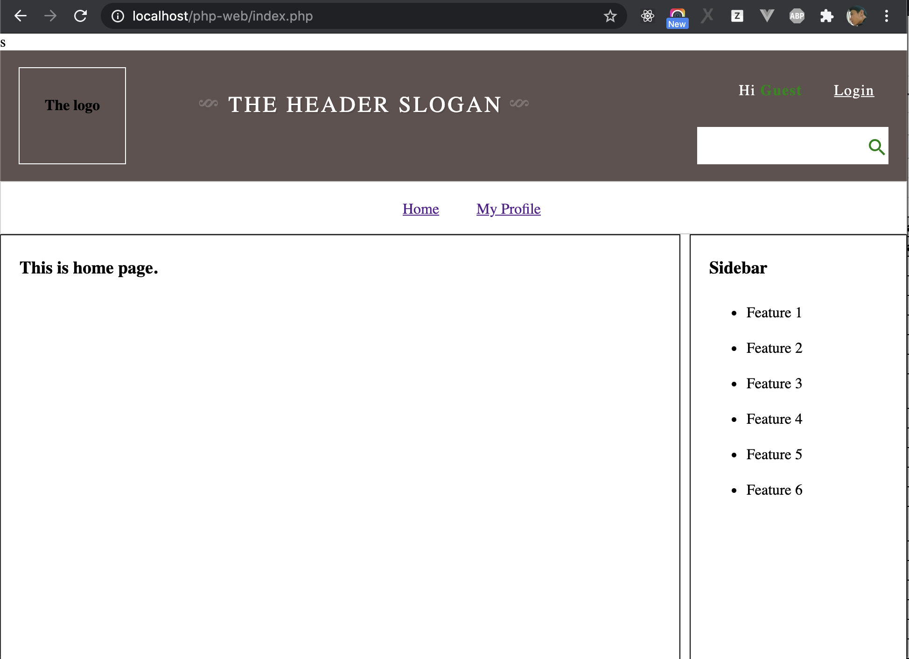

# Using PHP To Render HTML Content

Before statring, let create new git branch for learning this chapter.

```sh
git checkout add-profile-page
git checkout -b php-render-html
```

## Render Page Title Dynamically for Home and My Profile Pages

Because "Home" and "My Profile" pages used same header `modules/partials/header.php`, open this file, you will see that page title tag is:

```html
<title>My web page</title>
```

Because the page title is static, so that "Home" and "My Profile" have the same Title. Now, we will try to change the page title of Home page is "Home" and the page title for page My Profile page is "My Profile" by using PHP Variable. 

Remember that we have a varible `$module` in `index.php`:

```php
<?php
// Get modules need to use for main content by using $_GET
$module = $_GET['m'];

# Include header
require __DIR__ . '/modules/partials/header.php';
# Include main contain
....
```

We will use `$module` to indentify page title for Home Page and My Profile. Open `modules/partials/header.php` and update it following:


```php
<?php
// Define an array to contain page titles
$pageTitles = array(
    'home' => "Home",
    "profile" => "My Profile",
);
// Get page title depend on what is using module. 
$pageTitle = $pageTitles[$module];
?>
<!DOCTYPE html>
<html lang="en">
    <head>
        <link rel="stylesheet" href="normalize.css">
        <meta charset="utf-8">
        <!-- use defined variable to render page title in HTML -->
        <title><?php echo $pageTitle; ?></title>
        <link rel="stylesheet" href="./assets/css/index.css" />
        <link rel="stylesheet" href="https://fonts.googleapis.com/icon?family=Material+Icons">

        <script src="./assets/js/index.js"></script>s
    </head>
    <body>
        <!-- The Header -->
        <header> 
        <div>
            <h4>The logo</h4>
        </div>
        <div>
                <h2 class="slogan">The header slogan</h2>
        </div>
        <div id="form">
            <ul>
                <li>Hi <span>Guest</span></li>
                <li><a href="javascript:void(0)" onclick="showLoginForm()">Login</a></li>
            </ul>
            
            <form id="login">
                <input type="text" name="username" placeholder="User name" />
                <input type="password" name="password" placeholder="Password"/>
                <label><input type="checkbox" name="rememberUsername" />Remember user name </label>
                <button type="submit" name="Login">Login</button>
            </form>
            <form method="GET" id="search">
                <input type="text" name="keyword" />
                <i class="material-icons">search</i>
            </form>
        </div>
        </header>
        
        <!-- The menu -->
        <nav>
            <ul>
                <li><a href="./index.php">Home</a></li>
                <li><a href="./index.php?m=profile">My Profile</a></li>
            </ul>
        </nav>
```

As below, we can see that we can use `echo` to render (ouput) HTML Content

## Render Items in Sidebar by PHP Variable

In above example, we leaned how to render a page title, we will try to render the items in Sidebar by PHP. 

The idea to render a list of items that we define an array to include these items, and loop though each item in array, use `echo` to ouput item on Sidebar.

Now, let open Sidebar at `modules/partials/sidebar.php` and do it.

```php
<?php
    // Define an array to include all items in Sidebar
    $features = ['Feature 1', 'Feature 2', 'Feature 3', 'Feature 4', 'Feature 5', 'Feature 6'];
?>
<div id="sidebar">
    <h3> Sidebar </h3>
    <ul>
    <!-- Loop though the array and ouput to HTML -->
    <?php foreach($features as $feature) { ?>
        <li><?php echo $feature; ?></li>
    <?php } ?>
    </ul>
</div>
```

The result is as below screenshot, the items is rendered from an array.



Finish this chapter, let push your changes to remote repository.

```sh
git add -A
git commit -m "using php to render html content"
git push origin php-render-html
```

[Next: PHP and MySQL](./php-mysql.md)
