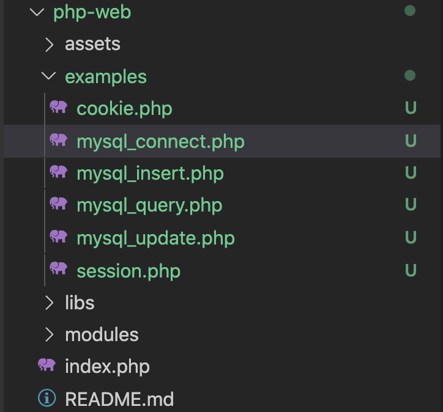
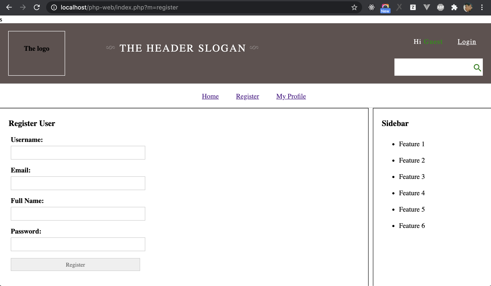
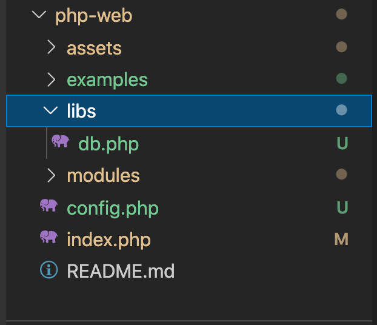
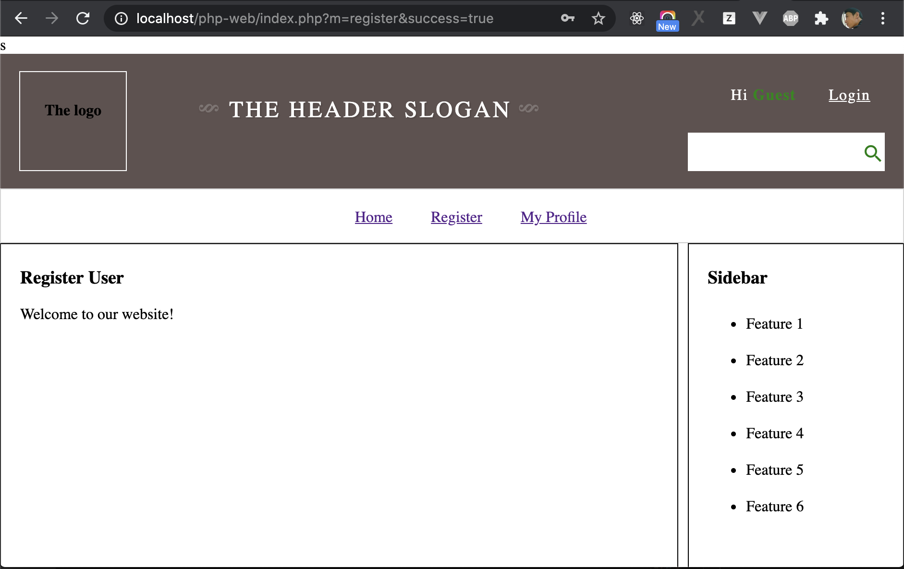
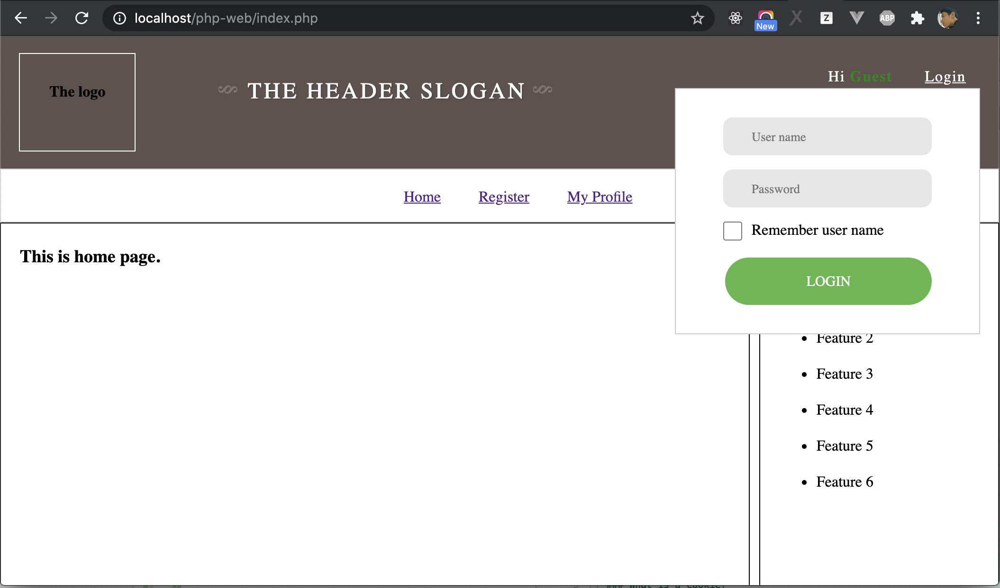
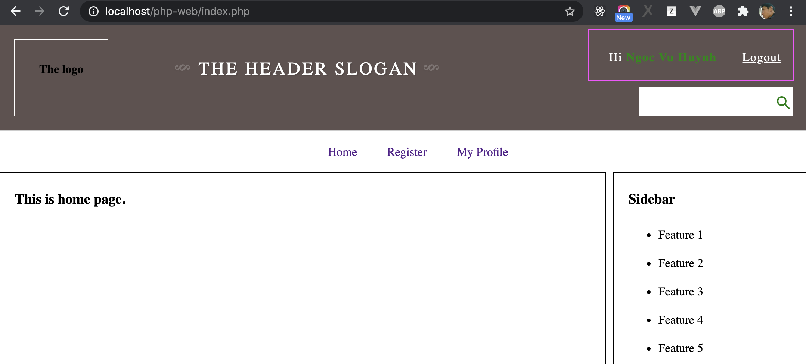

# Implement Register and Login

In this chapter, we will apply what we have learned before to build features Register and Login for user.

## Before Starting: Clean Project

Create new git branch

```sh
git checkout cookie-session
git checkout -b register-login
```

In chapter `PHP MySQL` and `Cookie-Session` we created some example file for exercise, it's only for learning how to work with MySQL and Session, Cookie, now create new folder `examples` under the folder `php-web`, and move all files: `mysql_connect.php, mysql_query.php, mysql_insert.php, mysql_update.php, cookie.php, session.php` to the folder `examples`, after move, folder structure will be like:

s

## Regiser An User

In this section, we will apply `mysqli` that we learned at before chapter to implement feature `Regiser User`. We will add new page Register and add a form with information: fullname, username, email, password into the page.

In order to create new page: Register, we add a new file `register.php` under the folder `php-web`, and add the HTML for register form as below:

```php
<!-- MAIN content -->
<div id="main">
    <div id="main-content">
        <h3>Register User</h3>
        <form method="post" class="form-register">
            <p>
                <label>Username: </label>
                <input type="text" name="fullname" />
            </p>
            <p>
                <label>Email: </label>
                <input type="text" name="email" />
            </p>
            <p>
                <label>Full Name: </label>
                <input type="text" name="fullname" />
            </p>
            <p>
                <label>Password: </label>
                <input type="password" name="password" />
            </p>
            <p><input type="submit" value="Register" /></p>
        </form>
    </div>
    <!-- embed sidbar.php -->
    <?php require __DIR__. '/partials/sidebar.php'; ?>
</div>
```

Add style for the form by adding below CSS source code to bottom of the file `assets/css/index.css`

```css
.form-register {
    margin: 5px;
}

.form-register label {
    font-weight: bold;
    display: flex;
    margin-bottom: 5px;
}

.form-register input {
    line-height: 30px;
    height: 30px;
    border: #ccc 1px solid;
    margin: 0px;
    padding: 0px 5px;
    width: 300px;
}
```

You also need to update header to add title for page Register, open file `modules/partials/header.php` and change:

```php
$pageTitles = array(
    'home' => "Home",
    "profile" => "My Profile"
);
```

To

```php
$pageTitles = array(
    'home' => "Home",
    "profile" => "My Profile",
    "register" => "Regiser" // Page title for Regiser
);
```

Because we added Regiser page, so that we need add a link on to this page on main menu. In `header.php`, let change main menu to below:

```HTML
    <ul>
    <li><a href="./index.php">Home</a></li>
    <li><a href="./index.php?m=register">Register</a></li>
    <li><a href="./index.php?m=profile">My Profile</a></li>
</ul>
```

Access to page http://localhost/php-web/index.php?m=register to check the form



### Create Class to Connect and Execute Query

In the chapter `PHP and MySQL`, we learned how to connect and execute a SQL Query, but you can realize that our source code is repeated in many files, for example, below source code is used in all files.

```php
<?php
$connection = new mysqli("localhost", "root", "", "php_web");
// if connection is error, ouput error message on screen and do stops
if ($connection->connect_error != null) {
    echo "<p>Failed to connect to MySQL: " . $connection->connect_error . '</p>';
}
?>
```

So that, we will create a class `DB` to connect and execute queries, and use this class to connect and execute queries. Let create new file `db.php` under the folder `libs`:

```php
// file db.php
<?php
class DB {
    private $host;
    private $user;
    private $password;
    private $db;
    private $conn;

    public function __construct($host, $user, $password, $db) {
        $this->host = $host;
        $this->user = $user;
        $this->password = $password;
        $this->db = $db;
    }

    public function connect() {
        $this->conn = new mysqli($this->host, $this->user, $this->password, $this->db);
        if ($this->conn->connect_error != null) {
            throw new Exception("Connect to MySQL failed. Error:" . $this->conn->connect_error);
        }
    }

    public function query($sql) {
        $this->connect();
        
        $result = $this->conn->query($sql);

        // If executing query failed, thow Exception
        if (!$result) {
            // If insert failed, show error.
            throw new Exception("Failed to execute query. Error: " . $this->conn->error);
        }

        return $result;
    }

    // Close connection
    public function __destruct() {
        echo "Close connection";
        if ($this->conn) {
            $this->conn->close();
        }
    }
}
```

After created class `DB`, you also should make a file `config.php` under `php-web` to define MySQL connection information.

```php
// File: config.php
// Below information is only an example, you need to change to correct information on you local environment. 
$dbConfig = [
    "host" => "localhost",
    "user" => "root",
    "password" => "",
    "db_name" => "php_web"
];
```

In order to use this class that all pages, we inlucude `config.php` and `db.php` in `index.php`, and create a object `$mysql`, then you can use this object at any page.

```php
<?php
ob_start();
// Get modules need to use for main content by using $_GET
$module = $_GET['m'];

// If there is no get param to load page, set $module default to home page
if ($module == null) {
    $module = 'home';
}

require __DIR__ . '/config.php';
require __DIR__ . '/libs/db.php';

// Define mysql object
$mysql = new DB(
    $db_config['host'],
    $db_config['user'],
    $db_config['password'],
    $db_config['db_name'],
);

# Include header
require __DIR__ . '/modules/partials/header.php';
# Include main contain

require __DIR__ . "/modules/$module.php";

# Include footer
require __DIR__ . '/modules/partials/footer.php';
ob_end_flush();
```

The folder structure after created `config.php` and `db.php`.



### Process Registering An User

Above steps, we made a form to input user data and also a class `DB` to execute SQL Queries. In order to register an user, just receive data from form and insert this data to `MySQL`, we already learn both, therefore just apply it by opening file `modules/register.php` and add source code and do below step:

- Show form to input data
- Use `$_POST` to retreice data submited from the form.
- Insert the data into MySQL.
- After insert data, reload this page with a param `success=true` (`http://localhost/php-web/index.php?m=register&success=true`). We also check if there is the param `success` is `true`, we hide the register form and show welcome message `Welcome to our website!`. 

```php
<?php
// Define variable to check if user is not registered, show register form
$isSuccess = $_GET['success'];

// Receive post data
if (!empty($_POST)) {
    // Receive post form dat   a
    $fullname = addslashes($_POST['fullname']);
    $username = addslashes($_POST['username']);
    $email = addslashes($_POST['email']);
    // hashing password
    $password = md5($_POST['password']); 
    
    // Define and execute SQL Query
    $sql = "INSERT INTO users(fullname, username, email, password)
        VALUE('$fullname', '$username', '$email', ' ')";

    // Define an array to contain errors when execute query,
    //  if there are errors, we will ouput to screen
    $errors = [];
    try {
        $result = $mysql->query($sql);
        // After insert data to MySQL, set form to hidden
        header('Location: index.php?m=register&success=true');
        exit;
    } catch (Exception $e) {
        // if there is error, push the error message to array $error
        array_push($errors, $e->getMessage());
    }

}
?>
<!-- MAIN content -->
<div id="main">
    <div id="main-content">
        <h3>Register User</h3>
        <?php
        // Check if there is any error, ouput the error to screen.
        if (isset($errors) && !empty($errors)) {
            foreach ($errors as $error) {
                echo '<p>'. $error . '</p>';
            }
        }
        ?>
        <?php
        // Check if user not registered, show form
        if (!$isSuccess) { ?>
            <form method="post" class="form-register">
                <p>
                    <label>Username: </label>
                    <input type="text" name="fullname" />
                </p>
                <p>
                    <label>Email: </label>
                    <input type="text" name="email" />
                </p>
                <p>
                    <label>Full Name: </label>
                    <input type="text" name="fullname" />
                </p>
                <p>
                    <label>Password: </label>
                    <input type="password" name="password" />
                </p>
                <p><input type="submit" value="Register" /></p>
            </form>
        <?php // if user registered, show welcome message 
        } else {
            echo "<p>Welcome to our website!</p>";
        } ?>
    </div>
    <!-- embed sidbar.php -->
    <?php require __DIR__. '/partials/sidebar.php'; ?>
</div>
```

In above source code, we use function `md5` to hash password `$password = md5($_POST['password']);`, let check how to use function `md5` at [here](https://www.w3schools.com/php/func_string_md5.asp). Note that if you don't hash the password, someone can access the database, then they can see the stored passwords, so that we need to use `md5` to hash the password.

We completed regiser function, access to http://localhost/php-web/index.php?m=register, enter information and click Regiser, you will see welcome message. You also can use `phpmyadmin` to check, you will see there is new record inserted into table `users`.



## Build Login Function



We already have login form as above screenshot. We will use this form to build login function. The scenario the build login function following below steps:

1. User input username and password in login form.
2. Submit username and password to a file php `login.php`
3. In file, `login.php`, receive data, check if it's matched with data in MySQL, process to login this user.
4. If login successfully, redirect to homepage. In header, we will show `Hi {Fullname}` instead of `Hi Guest`, and change `Login` to `Logout`

### Step 1: Update Login Form

Open file `modules/partials/header.php` to check source code of Login Form, you will see there is no action in the form, add `action` to form as below:

```html
<form id="login" action="./index.php?m=login" method="post">
    <input type="text" name="username" placeholder="User name" />
    <input type="password" name="password" placeholder="Password"/>
    <label><input type="checkbox" name="rememberUsername" />Remember user name </label>
    <button type="submit" name="Login">Login</button>
</form>
```

### Step 2: Make new file `login.php` to process User Login

Create new file `login.php` under the folder `php-web` to receive form data and process login. The scenario to process user login will be:

- Receive username and password from form.
- Query user by comparing username and `md5(password)`
- If there is user return, set a session with value is the ID of user. If the there is a session with value is valid user ID, user is logged in.

```php
<?php
// Receive form data 
$username = addslashes($_POST['username']);
$password = md5($_POST["password"]);


// query user data by $username and $password
$sql = "SELECT id, username, password 
    FROM users 
    WHERE username = '$username' AND password = '$password'
    LIMIT 0,1";

$result = $mysql->query($sql);
$user = $result->fetch_array() ?? false;

if (!$user) {
    echo "<p>Login failed</p>";
} else {
    // Set session for login
    $_SESSION["login_user_id"] = $user['id'];
    // Redirect to home page after login
    header('Location: index.php');
}
?>
```

Remember that in order to use `$_SESSION`, you must put `session_start()` at top of `index.php`

```php
<?php
session_start();
ob_start();
// Get modules need to use for main content by using $_GET
$module = $_GET['m'];

// If there is no get param to load page, set $module default to home page
if ($module == null) {
    $module = 'home';
}

require __DIR__ . '/config.php';
require __DIR__ . '/libs/db.php';

// Define mysql object
$mysql = new DB(
    $dbConfig['host'],
    $dbConfig['user'],
    $dbConfig['password'],
    $dbConfig['db_name'],
);

# Include header
require __DIR__ . '/modules/partials/header.php';
# Include main contain

require __DIR__ . "/modules/$module.php";

# Include footer
require __DIR__ . '/modules/partials/footer.php';
ob_end_flush();
```

### Update Header to Show Logged In User

- After set session to mark that user is loggin, we will use this session to check and get user information, and show `Hi {Fullname}`. Open header `modules/partials/header.php`, add source code to get user information at top:

```php
<?php
// Get session and assign to varibale $userId
$userId = $_SESSION['user_login_id'];

if ($userId) {
    // query user data by $username and $password
    $sql = "SELECT id, username, email, fullname, password 
        FROM users 
        WHERE id = $userId
        LIMIT 0,1";

    $result = $mysql->query($sql);

    // If there is user information, mean that user is logged-in
    $user = $result->fetch_array() ?? false;
}

// Define fullname to show on header
$fullname = $user ? $user['fullname'] : 'Guest';
```

And to show Fullname, use varibale `$fullmame` defined above: replace `<li>Hi <span>Guest</span></li>` by `<li>Hi <span><?php echo $fullname; ?></span></li>`. 

In order to change the text `Login` to `Logout` if user logged-in, we just need to check if there is `$user` or not:

```php
<?php if (!$user) { ?>
    <li><a href="javascript:void(0)" onclick="showLoginForm()">Login</a></li>
<?php } else { ?>
    <li><a href="javascript:void(0)">Logout</a></li>
<?php } ?>
```

Full source code of `header.php`:

```php
<?php
    // Define an array to contain page titles
    $pageTitles = array(
        'home' => "Home",
        "profile" => "My Profile",
        "register" => "Regiser"
    );
    // Get page title depend on what is using module
    $pageTitle = $pageTitles[$module];

    // Get session for checking user logged-in or not
    $userId = $_SESSION['user_login_id'];
    // Default, user is not logged-in
    $user = false;
    if ($userId) {
        // query user data by $username and $password
        $sql = "SELECT id, username, email, fullname 
            FROM users 
            WHERE id = $userId
            LIMIT 0,1";

        $result = $mysql->query($sql);
        $user = $result->fetch_array() ?? false;
    }

    // Define fullname to show on header
    $fullname = $user ? $user['fullname'] : 'Guest';
?>
<!DOCTYPE html>
<html lang="en">
    <head>
        <link rel="stylesheet" href="normalize.css">
        <meta charset="utf-8">
        <!-- use defined variable to render page title in HTML -->
        <title><?php echo $pageTitle; ?></title>
        <link rel="stylesheet" href="./assets/css/index.css" />
        <link rel="stylesheet" href="https://fonts.googleapis.com/icon?family=Material+Icons">

        <script src="./assets/js/index.js"></script>
    </head>
    <body>
        <!-- The Header -->
        <header>
        <div>
            <h4>The logo <?php echo $_SESSION['login_user_id']; ?></h4>
        </div>
        <div>
                <h2 class="slogan">The header slogan</h2>
        </div>
        <div id="form">
            <ul>
                <li>Hi <span><?php echo $fullname; ?></span></li>
                <li><a href="javascript:void(0)" onclick="showLoginForm()">Login</a></li>
            </ul>

            <form id="login" action="index.php?m=login" method="post">
                <input type="text" name="username" placeholder="User name" />
                <input type="password" name="password" placeholder="Password"/>
                <label><input type="checkbox" name="rememberUsername" />Remember user name </label>
                <button type="submit" name="Login">Login</button>
            </form>
            <form method="GET" id="search">
                <input type="text" name="keyword" />
                <i class="material-icons">search</i>
            </form>
        </div>
        </header>

        <!-- The menu -->
        <nav>
            <ul>
                <li><a href="./index.php">Home</a></li>
                <li><a href="./index.php?m=register">Register</a></li>
                <li><a href="./index.php?m=profile">My Profile</a></li>
            </ul>
        </nav>
```

Now, open Login form by click on `Login`, enter username and password of an user that you registered. And click `Login` button, we you see that you logged in.



Push changes to remote repository before go to next.

```sh
git add -A
git commit -m "register and login"
git push origin register-login
```

[Next: Homework](./homework.md)


