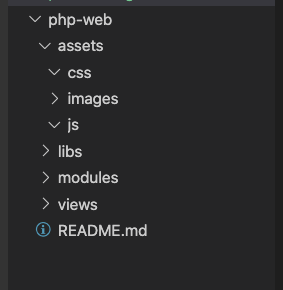
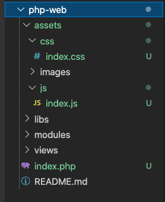
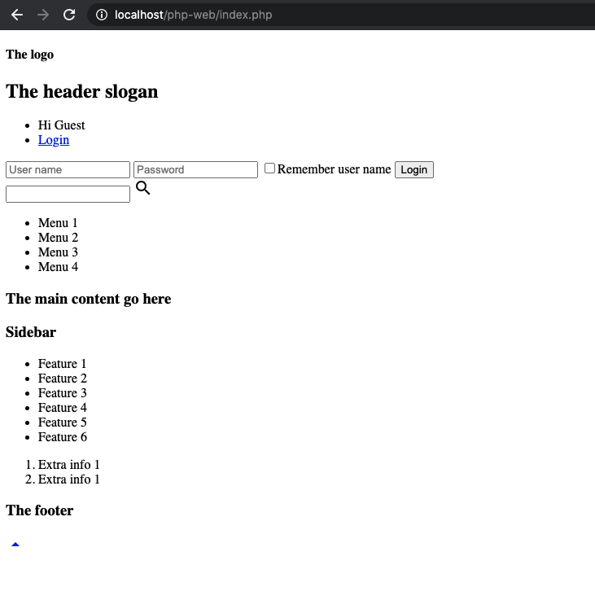
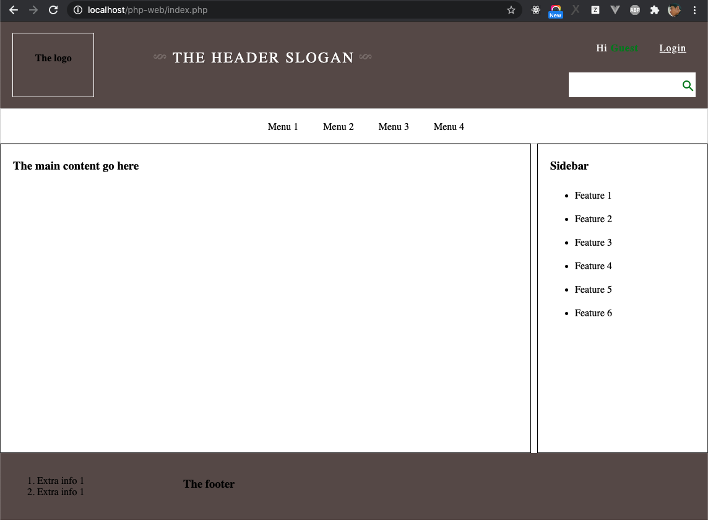
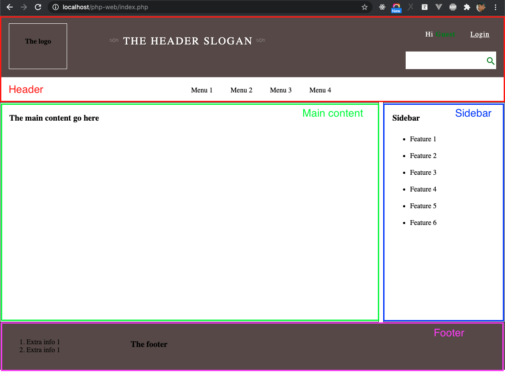
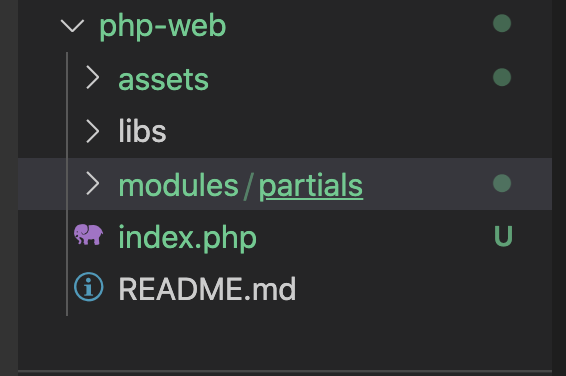
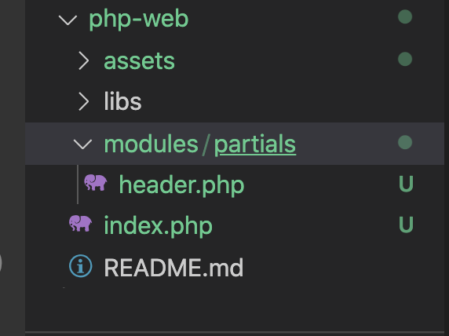
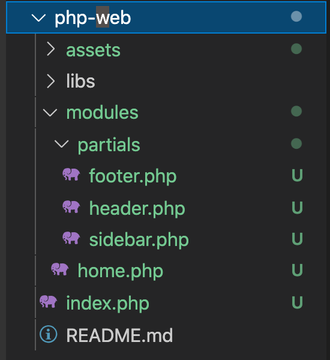

# Setup PHP Project

Because you are already setup PHP/Apache/MySQL when you learn PHP, so that you don't need to setup environment here.

## Create git repository

Create a repository name `php-web` under your account, please check at "Add a README file", after created the repository, clone it into you WEBROOT folder

```sh
cd YOUR_WEBROOT
# Change git@github.com:pa-vuhn/php-web.git to your repository
git clone git@github.com:pa-vuhn/php-web.git
cd php-web
```

Create new branch to make project structure

```sh
# Create new branch
git checkout -b source-code-structure
```
Now, let go to make source code structure.

### Make Folder Structure

Let make structure in `php-web` folder as below:




- **assets**: store static files such as javascript, css, images...
- **assets/css**: store stylesheet files (css).
- **assets/js**: store javascript files.
- **libs**: store common php files used in the project.
- **modules**: store php files, will be used to implement web page.
- **modules/common**: store commond php, used in all pages.

Now, re-use exercise source code of `html-css-js`, it is at `/web-development/docs/src/html-css-js/exercises-2`, copy files in this folder to `php-web`:

1. Copy `index.css` to `php-web/assets/css`
2. Copy `index.js` to `php-web/assets/js`
3. Copy `index.html` to `php-web/` and and rename `index.html` to `index.php`

After copied, the folder `php-web` will be the below screenshow



Now, let try to access the the website at http://localhost/php-web/index.php. The result will be like:



You see that the website is broken, the reason is that we moved `index.css` to `assets/css` and `index.js` to `assets/js`, therefore we will fix it to correct the web UI.

Open `index.php` and modify css and javascript path.

**Modify CSS path**

Change line:

```html
<link rel="stylesheet" href="index.css" />
```
To:
```html
<link rel="stylesheet" href="./assets/css/index.css" />
```
**Modify Javascript path**

Change line:
```html
<script src="index.js"></script>
```
To:
```html
<script src="./assets/js/index.js"></script>
```

Access to the URL http://localhost/php-web/index.php again to check UI, it is fixed.


## Header - Footer - Main Content - Sidebar



Let take a look on above screenshot, there are 4 main parts:

1. Header
2. Main Content
3. Sidebar
4. Footer

Imagine that you will create more other pages. In new pages, Header, Sidebar and Footer is same with `index`, so that we should separate `Header, Footer, Sidebar` to PHP files, in re-use them by using  `require`, please check more `require` at https://www.w3schools.com/php/php_includes.asp

Create new folder name `partials` under `modules` to contain them. Now, the structre of project is:



### Make New File To Separate The Header

Create file `header.php` under `modules/partials`. Open `index.php`, copy the source code of `Header` to `header.php`, the content of file `modules/partials/header.php` will be from beginning of file until end of the menu: 

**Note: You should check the source code in `index.php` and copy it, and compare with below source code, instead of copy below source code to `header.php`**

```html
<!DOCTYPE html>
<html lang="en">
    <head>
        <link rel="stylesheet" href="normalize.css">
        <meta charset="utf-8">
        <title>My web page</title>
        <link rel="stylesheet" href="./assets/css/index.css" />
        <link rel="stylesheet" href="https://fonts.googleapis.com/icon?family=Material+Icons">

        <script src="./assets/js/index.js"></script>s
    </head>
    <body>
        <!-- The Header -->
        <header> 
        <div>
            <h4>The logo</h4>
        </div>
        <div>
                <h2 class="slogan">The header slogan</h2>
        </div>
        <div id="form">
            <ul>
                <li>Hi <span>Guest</span></li>
                <li><a href="javascript:void(0)" onclick="showLoginForm()">Login</a></li>
            </ul>
            
            <form id="login">
                <input type="text" name="username" placeholder="User name" />
                <input type="password" name="password" placeholder="Password"/>
                <label><input type="checkbox" name="rememberUsername" />Remember user name </label>
                <button type="submit" name="Login">Login</button>
            </form>
            <form method="GET" id="search">
                <input type="text" name="keyword" />
                <i class="material-icons">search</i>
            </form>
        </div>
        </header>
        
        <!-- The menu -->
        <nav>
            <ul>
                <li>Menu 1</li>
                <li>Menu 2</li>
                <li>Menu 3</li>
                <li>Menu 4</li>
            </ul>
        </nav>
```

Folder structure after created `header.php`



### Make New File To Separate The Footer

Create new file `footer.php` in same folder with `header.php` (under the folder `modules/partials`). Open `index.php`, analyze the source code is used for `Footer`, you will se that it is from the tag `<footer>` until end of page, copy this source code to `footer.php`:

The content of `footer.php` is:

```html
        <footer>
            <ol>
                <li>Extra info 1</li>
                <li>Extra info 1</li>
            </ol>
            <h3> The footer</h3>
            <div id="scroll"> 
                <a href="javascript:void(0)" onclick="scrollToTop()"> 
                    <i class="material-icons">arrow_drop_up</i>
                </a>
            </div>
        </footer>
    </body>
</html>
```

### Make New File To Separate The Sidebar

Create file `sidebar.php` under `modules/partials` to contain source code of the `Sidebar`. Continue to analyze `index.php`, you will see that the source code of `Sidebar` is:

```html
<div id="sidebar">
    <h3> Sidebar </h3>
    <ul>
        <li>Feature 1</li>
        <li>Feature 2</li>
        <li>Feature 3</li>
        <li>Feature 4</li>
        <li>Feature 5</li>
        <li>Feature 6</li>
    </ul>
</div>
```

### Make New File To Separate The Main Content

Take a look on `index.php`, and you will see that main content of `index.php` is the tag `<div id="main">` and the content inside this tag.

```html
<!-- MAIN content -->
<div id="main">
    <div id="main-content">
        <h3> The main content go here</h3>
    </div>
    <div id="sidebar">
        <h3> Sidebar </h3>
        <ul>
            <li>Feature 1</li>
            <li>Feature 2</li>
            <li>Feature 3</li>
            <li>Feature 4</li>
            <li>Feature 5</li>
            <li>Feature 6</li>
        </ul>
    </div>
</div>
```

Create a file `home.php` under `modules` to contain source code of index page (also called home page). **Note that `home.php` must be under the folder `modules`, because it is a page, not commond parts likes `Header, Footer, Sidebar`

There is a strange point that the `Sidebar` is inside `Main Content`. Because at above step, we create a file at `modules/partials/sidebar.php` to contain source code of `Sidebar`, so that, we will delete source code of the `Sidebar` in `Main Content`, and use `require` to `embed` the `Sidebar` to `Main Content`. 

The source code of file `modules/home.php` will be

```php
<!-- MAIN content -->
<div id="main">
    <div id="main-content">
        <h3> The main content go here</h3>
    </div>
    <!-- embed sidbar.php -->
    <?php require __DIR__ . '/partials/sidebar.php' ?>
</div>
```

Note: `__DIR__` will return the current directory of the file.

After created `Header, Footer, Sidebar, Main Content`, the folder structure will be like below screenshot:



### Update index.php

Above steps, we separeated `index.php` to `header.php, footer.php, sidebar.php, home.php`. Now, we will update `index.php` by include above files to `index.php`. Let open `index.php` and modify it as below:

```php
<?php
# Include header
require __DIR__ . '/modules/partials/header.php';
# Include main contain
require __DIR__ . '/modules/home.php';
# Include footer
require __DIR__ . '/modules/partials/footer.php';
```

We have finished creating structure for the project, access the URL http://localhost/php-web/index.php

## Push Changes on Git Repository

After finished make structure for the project, let push the changes on remote repository

```sh
# Check changes
git status
git add -A
git commit -m "init project"
git push origin source-code-structure
```

## Conclusion

You have learned how to make basic structure for PHP project, the idea is that separate commond source code to files, and re-use in other files when we need them.

[Next - Loading page dynamically](./add-page.md)
